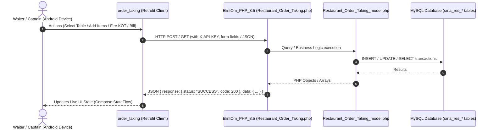

# 🔗 Complete API & Endpoints Mapping — Order Taking & ElintOm POS

> **Repos Covered:**
> 1. `order_taking` (Android Client — Kotlin / Retrofit / Jetpack Compose)
> 2. `ElintOm_PHP_8.5` (Backend Server — PHP 8.x / CodeIgniter 3 / MySQL)

---

## 🏗️ Architecture & Communication Flow



---

## 📡 Complete Module-Wise Endpoints Reference

---

### 1️⃣ Authentication & Branding

#### `GET /branding`
* **Purpose:** Dynamically load restaurant logo, company title, and theme color on splash screen.
* **📱 Android (Client):**
  * Method: `RestaurantApiService.getBranding(): Response<ApiResponse<BrandingInfo>>`
  * Model: `BrandingInfo(siteName, companyName, mobileAppName, loginTitle, logoUrl, primaryColor)`
* **💻 Backend (CI3):**
  * Controller: `Restaurant_Order_Taking::branding()`
  * Model: Reads `sma_settings` & `sma_pos_settings`
* **📥 Response Payload:**
  ```json
  {
    "response": { "status": "SUCCESS", "code": 200 },
    "data": {
      "site_name": "ElintOm Restaurant",
      "company_name": "ElintOm Dining",
      "mobile_app_name": "Order Taking",
      "login_title": "Restaurant Order Taking",
      "logo_url": "http://localhost/ElintOm_PHP_8.5/assets/uploads/logos/logo.png",
      "primary_color": "#E9176B"
    }
  }
  ```

#### `POST /login`
* **Purpose:** Captain / Waiter login verification.
* **📱 Android (Client):**
  * Method: `RestaurantApiService.login(identity, password, username, role): Response<ApiResponse<LoginUser>>`
* **💻 Backend (CI3):**
  * Controller: `Restaurant_Order_Taking::login()` (or `Auth::login`)
  * Validation: Verifies identity, password hash with `ion_auth` / `sma_users`.
* **📥 Response Payload:**
  ```json
  {
    "response": { "status": "SUCCESS", "code": 200 },
    "data": {
      "user_id": 5,
      "username": "captain1",
      "email": "captain@restaurant.com",
      "display_name": "Ramesh Captain",
      "role": "Captain"
    }
  }
  ```

---

### 2️⃣ Floor, Section & Table Management

#### `GET /sections`
* **Purpose:** Fetch list of all restaurant dining sections (Main Dining, AC Hall, Garden, Rooftop).
* **📱 Android (Client):**
  * Method: `RestaurantApiService.getSections(): Response<ApiResponse<List<Section>>>`
* **💻 Backend (CI3):**
  * Controller: `Restaurant_Order_Taking::sections()` / `load_sections()`
  * Model: `Restaurant_Order_Taking_model->get_sections()`
  * DB: `SELECT * FROM sma_res_sections WHERE is_deleted=0`

#### `POST /subsections`
* **Purpose:** Get subsections/halls for a specific floor section.
* **📱 Android (Client):**
  * Method: `RestaurantApiService.getSubsections(section_id): Response<ApiResponse<List<Subsection>>>`
  * Parameters: `@Field("section_id") sectionId: String`
* **💻 Backend (CI3):**
  * Controller: `Restaurant_Order_Taking::load_subsections()`
  * Model: `Restaurant_Order_Taking_model->get_subsections($section_id)`
  * DB: `SELECT * FROM sma_res_subsections WHERE section_id = ?`

#### `POST /tables`
* **Purpose:** Get tables list with live statuses (Available, Occupied, KOT Sent, Ready, Reserved).
* **📱 Android (Client):**
  * Method: `RestaurantApiService.getTables(section_id, subsection_id): Response<ApiResponse<List<TableItem>>>`
* **💻 Backend (CI3):**
  * Controller: `Restaurant_Order_Taking::load_tables()`
  * Model: `Restaurant_Order_Taking_model->get_tables($section_id, $subsection_id)`
  * DB: Joins `sma_res_tables` with active orders in `sma_res_orders`.
* **📥 Response Payload:**
  ```json
  {
    "response": { "status": "SUCCESS", "code": 200 },
    "data": [
      {
        "id": "12",
        "table_number": "T-12",
        "section_id": "1",
        "status": "occupied",
        "guests_count": 4,
        "occupied_time": "2026-08-25 14:30:00",
        "order_id": "108"
      }
    ]
  }
  ```

#### `POST /reserve_table` & `POST /unreserve_table`
* **Purpose:** Reserve table with customer name and time / cancel reservation.
* **📱 Android (Client):**
  * Method: `RestaurantApiService.reserveTable(table_id, reserved_by, reserved_until, reserved_note)`
  * Method: `RestaurantApiService.unreserveTable(table_id)`
* **💻 Backend (CI3):**
  * Controller: `Restaurant_Order_Taking::reserve_table()`, `unreserve_table()`
  * Model: `Restaurant_Order_Taking_model->update_table_reservation(...)`
  * DB: `sma_res_tables` (`status_id = Reserved`, `reserved_by`, `reserved_until`)

---

### 3️⃣ Menu Catalog & Customizations

#### `GET /menu_categories`
* **Purpose:** List food menu categories with icons.
* **📱 Android (Client):**
  * Method: `RestaurantApiService.getMenuCategories(): Response<ApiResponse<List<MenuCategory>>>`
* **💻 Backend (CI3):**
  * Controller: `Restaurant_Order_Taking::get_menu_categories()`
  * Model: `Restaurant_Order_Taking_model->get_menu_categories()`
  * DB: `sma_categories` (id, name, code, image)

#### `POST /menu_items`
* **Purpose:** Fetch dishes with search filter, category filter, veg/non-veg flags, and prices.
* **📱 Android (Client):**
  * Method: `RestaurantApiService.getMenuItems(category_id, meal_type, search): Response<ApiResponse<List<MenuItem>>>`
* **💻 Backend (CI3):**
  * Controller: `Restaurant_Order_Taking::get_menu_items()`
  * Model: `Restaurant_Order_Taking_model->get_menu_items($filters)`
  * DB: `sma_products` (id, name, code, price, type, meal_type_id)

#### `POST /product_customizations`
* **Purpose:** Fetch allowed Add-ons, Toppings, Meat Wellness levels, and Allergy tags for a dish.
* **📱 Android (Client):**
  * Method: `RestaurantApiService.getProductCustomizations(product_id): Response<ApiResponse<ProductCustomization>>`
* **💻 Backend (CI3):**
  * Controller: `Restaurant_Order_Taking::get_product_customizations()`
  * Model: Combines `sma_res_product_add_ons`, `sma_res_product_toppings`, `sma_res_common_allergies`, `sma_res_meat_wellness`
* **📥 Response Payload:**
  ```json
  {
    "response": { "status": "SUCCESS", "code": 200 },
    "data": {
      "product_id": "45",
      "add_ons": [
        { "id": "1", "name": "Extra Cheese", "price": 40.0 },
        { "id": "2", "name": "Peri Peri Dip", "price": 25.0 }
      ],
      "spice_levels": ["Mild", "Medium", "Spicy", "Extra Hot"],
      "meat_wellness": ["Medium", "Well Done"],
      "allergies": [
        { "id": "1", "name": "Peanuts", "price": 0.0 },
        { "id": "2", "name": "Gluten", "price": 0.0 }
      ]
    }
  }
  ```

---

### 4️⃣ Live Order Management & Guest Cart

#### `POST /order_bootstrap`
* **Purpose:** Fetch complete active order details for a table (Guest breakdown, ordered items, grand total).
* **📱 Android (Client):**
  * Method: `RestaurantApiService.getOrderBootstrap(table_id, order_id): Response<ApiResponse<OrderBootstrap>>`
* **💻 Backend (CI3):**
  * Controller: `Restaurant_Order_Taking::orders($table_id)` / `get_order_status()`
  * Model: Aggregates `get_order()`, `get_order_guests()`, `get_order_items()`, `get_order_totals()`.
* **📥 Response Payload:**
  ```json
  {
    "response": { "status": "SUCCESS", "code": 200 },
    "data": {
      "order_id": "108",
      "table_id": "12",
      "table_number": "T-12",
      "section_name": "Main Dining",
      "guest_count": 2,
      "status": "active",
      "guests": [
        {
          "guest_id": 1,
          "guest_name": "Guest 1",
          "items": [
            {
              "id": "201",
              "product_id": "45",
              "product_name": "Paneer Butter Masala",
              "price": 280.0,
              "quantity": 1,
              "spice_level": "Medium",
              "onion_flag": false,
              "garlic_flag": false,
              "status": "pending"
            }
          ]
        }
      ],
      "total_items": 1,
      "grand_total": 280.0
    }
  }
  ```

#### `POST /create_order`
* **Purpose:** Open new order for a table with specified initial guest count.
* **📱 Android (Client):**
  * Method: `RestaurantApiService.createOrder(table_id, guest_count)`
* **💻 Backend (CI3):**
  * Controller: `Restaurant_Order_Taking::create_order()`
  * Model: `Restaurant_Order_Taking_model->create_order()` -> inserts into `sma_res_orders`, creates guest rows in `sma_res_orders_guests`, updates table status to Occupied (`2`).

#### `POST /add_item`
* **Purpose:** Add customized dish item allocated to a specific guest.
* **📱 Android (Client):**
  * Method: `RestaurantApiService.addItem(order_id, guest_id, product_id, quantity, spice_level, meat_wellness, allergies, custom_allergies, add_ons, toppings, onion_flag, garlic_flag, special_instructions)`
* **💻 Backend (CI3):**
  * Controller: `Restaurant_Order_Taking::add_item()`
  * Model: Calculates total line amount (`base_price + add_ons + toppings * qty`) and inserts into `sma_res_orders_items`.

#### `POST /update_item` & `POST /delete_item`
* **Purpose:** Change item quantity/customization or remove item from order.
* **📱 Android (Client):**
  * Methods: `RestaurantApiService.updateItem(...)`, `RestaurantApiService.deleteItem(item_id)`
* **💻 Backend (CI3):**
  * Controller: `Restaurant_Order_Taking::update_item_quantity()`, `delete_order_item()`
  * Model: Updates/Deletes in `sma_res_orders_items` and recalculates order total.

#### `POST /increase_guest` & `POST /decrease_guest`
* **Purpose:** Dynamically add or remove guest slot in table order.
* **💻 Backend (CI3):** `Restaurant_Order_Taking::increase_guest()`, `decrease_guest()`.

---

### 5️⃣ Kitchen Display (KDS) & KOT Flow

#### `POST /update_kot_status` / `push_to_kds`
* **Purpose:** **🔥 Fire KOT:** Send pending items to Kitchen Display System (KDS) / Kitchen Printer.
* **📱 Android (Client):**
  * Method: `RestaurantApiService.updateKotStatus(order_id): Response<ApiResponse<OrderBootstrap>>`
* **💻 Backend (CI3):**
  * Controller: `Restaurant_Order_Taking::push_to_kds()`
  * Logic:
    1. Fetches pending items from `sma_res_orders_items`.
    2. Builds suspended bill payload for POS KDS (`pos_model->suspendSale`).
    3. Updates items status from `Pending` -> `KOT / Preparing`.

#### `POST /mark_ready` & `POST /mark_served`
* **Purpose:** Chef marks order ready -> Captain marks order served to guests.
* **💻 Backend (CI3):** `Restaurant_Order_Taking::update_item_status()` -> Updates `status = 'Ready' | 'Served'`.

---

### 6️⃣ Billing, Finalization & Table Release

#### `POST /finalize_order`
* **Purpose:** Complete order, generate formal POS Sale, compute taxes, and return Invoice URL.
* **📱 Android (Client):**
  * Method: `RestaurantApiService.finalizeOrder(order_id): Response<ApiResponse<FinalizeOrderResponse>>`
  * Model: `FinalizeOrderResponse(saleId, invoiceUrl, grandTotal)`
* **💻 Backend (CI3):**
  * Controller: `Restaurant_Order_Taking::finalize_order()`
  * Logic:
    1. Validates order items.
    2. Inserts POS Sale record into `sma_sales` & `sma_sale_items`.
    3. Updates order status in `sma_res_orders` to `Completed`.
    4. Sets table status in `sma_res_tables` back to `Available` (Free).
    5. Returns printable invoice link `pos/view/{sale_id}`.

#### `POST /complete_and_free`
* **Purpose:** One-click instant table release after cash/card payment.
* **💻 Backend (CI3):** `Restaurant_Order_Taking::complete_and_free()`.

---

## 🗄️ MySQL Database Schema Quick Reference

| Table Name | Purpose | Key Columns |
| :--- | :--- | :--- |
| `sma_res_sections` | Dining Sections (AC, Garden, Rooftop) | `id`, `name`, `is_deleted` |
| `sma_res_subsections` | Sub-sections / Halls | `id`, `section_id`, `name` |
| `sma_res_tables` | Table inventory & live status | `id`, `table_number`, `section_id`, `status_id`, `reserved_by`, `reserved_until` |
| `sma_res_orders` | Active restaurant dining sessions | `id`, `res_tables_id`, `guest_count`, `status`, `payment_status`, `created_at` |
| `sma_res_orders_guests` | Guest allocations under an order | `id`, `res_orders_id`, `guest_number` |
| `sma_res_orders_items` | Dishes ordered with customizations | `id`, `res_orders_id`, `res_orders_guests_id`, `sma_product_id`, `quantity`, `price`, `spice_level`, `allergies`, `add_ons`, `onion_flag`, `garlic_flag`, `status` |
| `sma_sales` | Permanent POS billing ledger | `id`, `reference_no`, `customer`, `total`, `grand_total`, `sale_status`, `payment_status` |
| `sma_suspended_bills` | Kitchen Display (KDS) live queue | `id`, `customer`, `table_id`, `suspend_note`, `count` |
