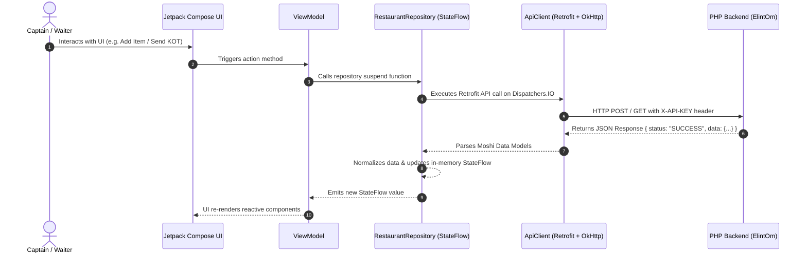

# 🏗️ Architecture, Load Balancing, Request Handling & Offline Resilience

This document provides a comprehensive technical overview of how **Load Balancing**, **Request Handling**, and **Internet/Network Connectivity Failure (Offline Mode)** are designed and implemented across the **Order Taking Android App** (`res_order_taking`) and the **CodeIgniter 3 PHP Backend** (`ElintOm_PHP_8.5`).

---

## 1. ⚖️ Load Balancing Architecture

### **Stateless RESTful Endpoints**
- The backend architecture (`ElintOm_PHP_8.5`) enforces strictly **stateless REST APIs**.
- Every incoming request carries authentication & token details (`X-API-KEY` header). No server-side session affinity or sticky sessions are required.
- **Horizontal Scaling:** The backend can be deployed across multiple PHP worker instances behind a Load Balancer (e.g. Nginx, HAProxy, or AWS ALB) without requiring session sharing between servers.

### **Dynamic Base URL Configuration**
- In the Android app, server routing is decoupled from hardcoded IP addresses via `ApiSettingsManager` and [`ApiClient.kt`](file:///c:/wamp64/www/res_order_taking/app/src/main/java/com/example/data/api/ApiClient.kt).
- Captains/Waiters can dynamically update the server IP/Port (e.g. switching between local LAN node `192.168.1.100` and primary Load Balancer `192.168.1.254`) via the live Settings Dialog without re-installing or restarting the application.

### **Connection Pooling & Socket Reuse**
- `OkHttpClient` instance inside `ApiClient` handles HTTP connection pooling with:
  - **Connect Timeout:** 15 seconds
  - **Read Timeout:** 15 seconds
  - **Connection Reuse:** Keeps sockets open for repeated requests, preventing socket exhaustion on local network servers during peak restaurant dining hours.

---

## 2. 🔄 End-to-End Request Handling Flow



### **Client-Side Request Lifecycle (Android / Kotlin)**
1. **Asynchronous Execution:** All API interactions in [`RestaurantRepository.kt`](file:///c:/wamp64/www/res_order_taking/app/src/main/java/com/example/data/repository/RestaurantRepository.kt) run asynchronously on background threads using Kotlin Coroutines (`withContext(Dispatchers.IO)`). Main UI thread stays unblocked at 60 FPS.
2. **Request Interception:** `authInterceptor` in `ApiClient` intercepts outgoing Retrofit calls and injects global headers (`X-API-KEY`, `Accept: application/json`).
3. **Reactive State Management:** Data returned from Retrofit is parsed into Moshi data models, updating central `MutableStateFlow` streams (`_sections`, `_tables`, `_orders`).

### **Server-Side Request Lifecycle (PHP CodeIgniter 3)**
1. **Controller Layer (`Restaurant_Order_Taking.php`):** Receives API payloads via `$this->input->post()` or `$this->input->get()`.
2. **Database Transactions:** Model operations wrapper (`trans_start()` / `trans_complete()`) guarantees atomic operations (e.g. deducting inventory + updating order item status + generating KOT simultaneously).
3. **Standard Response Formatting:** All endpoints return uniform JSON output:
   ```json
   {
     "response": {
       "status": "SUCCESS",
       "message": "Operation completed successfully"
     },
     "data": { ... }
   }
   ```

---

## 3. 🌐 Internet & Network Connectivity Loss (Offline Resilience)

### **1. Zero-Crash Exception Handling**
- Every Retrofit network call in [`RestaurantRepository.kt`](file:///c:/wamp64/www/res_order_taking/app/src/main/java/com/example/data/repository/RestaurantRepository.kt) is encapsulated inside a `try { ... } catch (e: Exception) { ... }` block.
- Network connection drops, Wi-Fi disconnections, or server timeouts (`SocketTimeoutException`, `UnknownHostException`) are gracefully caught without crashing the application.

### **2. In-Memory State & Fallback Data Providers**
- If an API call fails due to loss of internet or local server connectivity:
  - The repository falls back to the **current in-memory `StateFlow` cache**.
  - If initial state is unpopulated, built-in fallback data providers (`getInitialSections()`, `getInitialTables()`, `getInitialOrders()`, `getInitialCategories()`) furnish mock structures.
- Waiters can continue navigating sections, checking table layouts, searching menu items, and drafting guest orders locally even when offline.

### **3. Live Re-connection & Dynamic Settings**
- **Connection Health Badge:** Displays live server connection state on the login screen and header.
- **Dynamic IP Recovery:** If the local server IP changes or Wi-Fi reconnects, captains can open the **Settings Dialog** from the login screen or top header bar to update the IP instantly without data loss.

---

## 📊 Feature Summary Matrix

| Scenario | Behavior / Solution | Architectural Component |
| :--- | :--- | :--- |
| **High Concurrent Orders** | Connection Pooling & Stateless PHP Controllers | OkHttp + CI3 REST Controllers |
| **Server Load Distribution** | Dynamic URL Configuration & Load Balancer readiness | `ApiClient.kt` + `ApiSettingsManager` |
| **UI Freeze Prevention** | Background Coroutine Thread Pool (`Dispatchers.IO`) | Kotlin Coroutines & Retrofit 2 |
| **Wi-Fi / Internet Disconnect** | `try-catch` wrapper + In-Memory Fallback State | `RestaurantRepository.kt` (`StateFlow`) |
| **Server IP Change** | In-app live URL / Port configuration dialog | `SettingsDialog.kt` + `SharedPreferences` |
