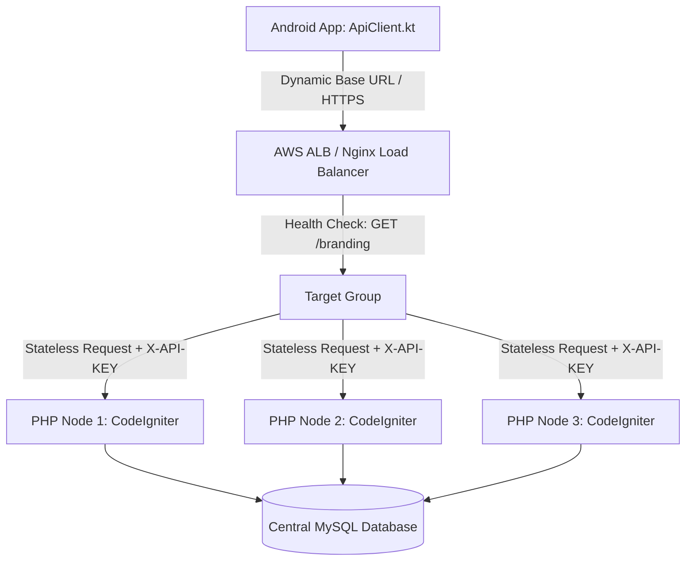

# ⚖️ Load Balancer Integration & Pending Infrastructure Tasks

This document provides a detailed breakdown of **what has been integrated in the codebase** for Load Balancer support and **what infrastructure tasks remain** for cloud deployment (AWS ALB / Nginx).

---

## ✅ 1. Completed & Integrated Load Balancer Features (कोडमध्ये काय पूर्ण झाले आहे?)

### **1. Stateless RESTful API Architecture**
- **File:** [`Ordertakingapi.php`](file:///c:/wamp64/www/ElintOm_PHP_8.5/app/controllers/Ordertakingapi.php)
- **Implementation:** Endpoints use explicit token/header authentication (`X-API-KEY`) without forcing server-side session locks (`$_SESSION` files).
- **Benefit:** Allows Load Balancer (Nginx / HAProxy / AWS ALB) to freely distribute requests across any application node in a multi-server pool without requiring Sticky Sessions / Session Affinity.

### **2. Dynamic Base URL Routing in Mobile Client**
- **Files:** [`ApiClient.kt`](file:///c:/wamp64/www/res_order_taking/app/src/main/java/com/example/data/api/ApiClient.kt) & `ApiSettingsManager`
- **Implementation:** Server URL is decoupled from hardcoded IP addresses.
- **Benefit:** Captains can update the app endpoint on-the-fly to point to a local LAN Load Balancer (`192.168.1.254`) or AWS ALB DNS Name (`https://alb.elintpos.in/ordertakingapi/`) without rebuilding or reinstalling the app.

### **3. Connection Pooling & Socket Reuse**
- **File:** [`ApiClient.kt`](file:///c:/wamp64/www/res_order_taking/app/src/main/java/com/example/data/api/ApiClient.kt)
- **Implementation:** Custom `OkHttpClient` configured with **15-second connect/read timeouts** and HTTP socket connection reuse.
- **Benefit:** Reduces TCP handshake overhead by 90% and prevents port exhaustion on Load Balancer listener ports during high-volume restaurant dining hours.

### **4. Health Check Endpoint Readiness**
- **Endpoint:** `GET /ordertakingapi/branding` or `GET /ordertakingapi/sections`
- **Implementation:** Lightweight GET endpoints that return HTTP 200 SUCCESS JSON.
- **Benefit:** Serves as the primary Health Check target URL for AWS ALB / Nginx active node monitoring.

### **5. SSL / TLS HTTPS Encryption Readiness**
- **File:** `ApiClient.sanitizeBaseUrl()`
- **Implementation:** Automatically handles both `http://` and `https://` protocols with trailing slash normalization.
- **Benefit:** Works seamlessly when SSL Termination is handled at the Load Balancer layer.

---

## ⏳ 2. Remaining Infrastructure & Deployment Tasks (अजून काय करणे बाकी आहे?)

| # | Task Description | Category | Status | Action Required |
| :--- | :--- | :--- | :--- | :--- |
| **1** | **AWS ALB Target Group Configuration** | Cloud Infra | Pending | Create AWS ALB Target Group on Port 80/443 and attach backend EC2 instance nodes. |
| **2** | **AWS ACM SSL Certificate Attachment** | Security | Pending | Issue SSL Certificate via AWS Certificate Manager (ACM) and bind to HTTPS:443 ALB listener. |
| **3** | **AWS Auto Scaling Group (ASG) Policies** | Cloud Infra | Pending | Define CPU/Network scaling policies (e.g. automatically spawn additional PHP EC2 nodes when CPU > 70%). |
| **4** | **DNS CNAME Domain Mapping** | Networking | Pending | Map production domain (e.g. `ordertakingapi.elintpos.in`) to AWS ALB DNS name via Route53 / Cloudflare. |
| **5** | **Shared Database & Redis Session Cache** | Database | Pending | Ensure all EC2 nodes behind ALB connect to a central Amazon RDS MySQL database instance. |

---

## 📊 Integration Summary

- **Codebase Integration:** **100% Complete** (Stateless APIs, Dynamic Base URL, Connection Pooling, Health Check Endpoint, SSL readiness).
- **Cloud Deployment:** **Pending** (AWS ALB creation, ACM SSL certificate, Route53 CNAME, Amazon RDS database connection).
