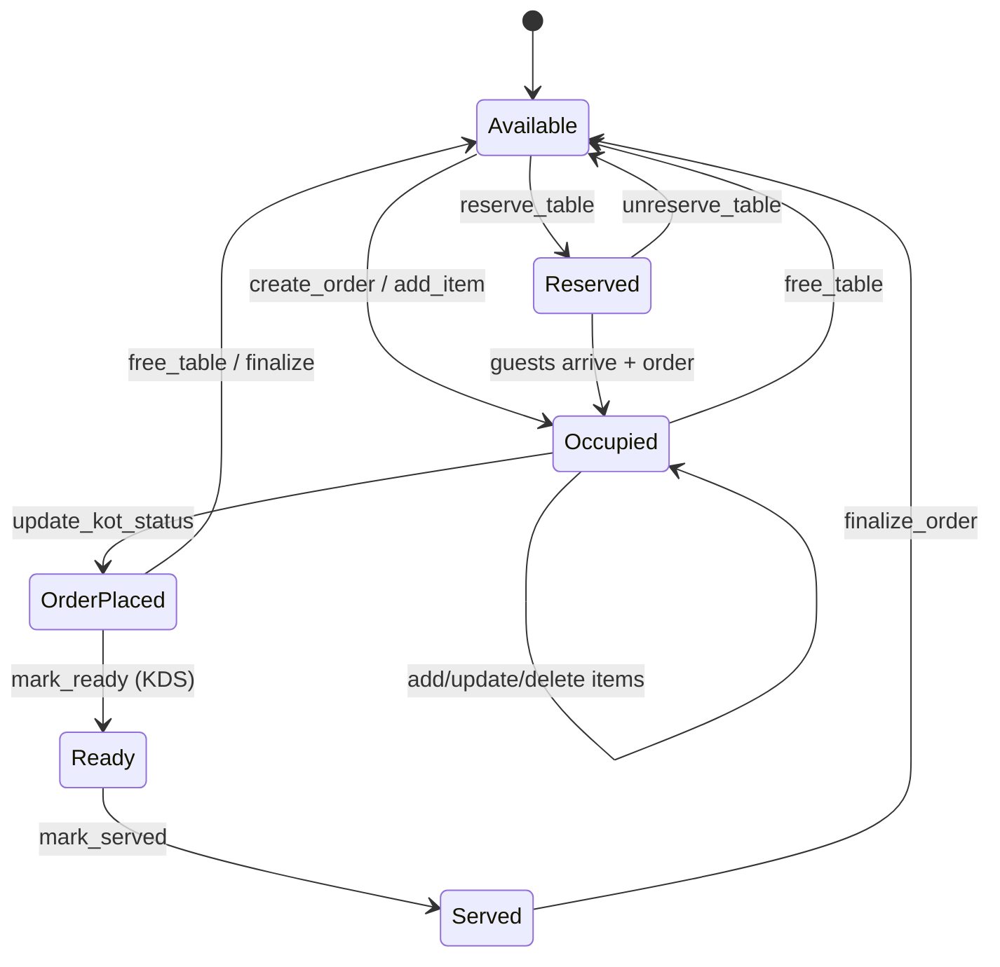
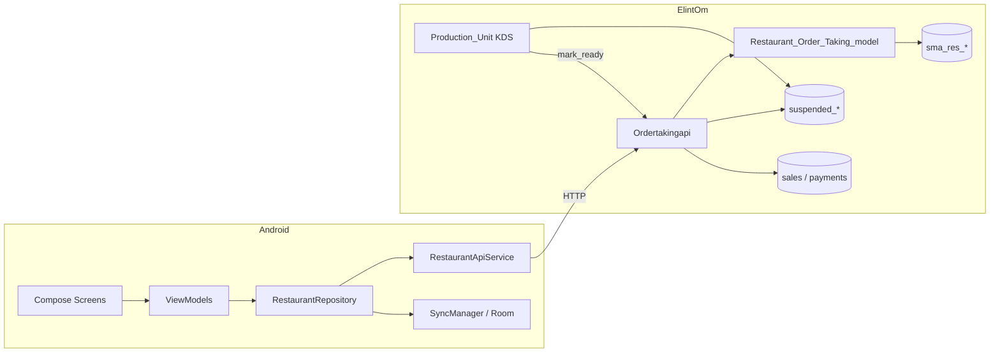

# Order Taking — Complete Deep Flow (Android + CodeIgniter)

> **Repos:** `res_order_taking` (Android) ↔ `ElintOm` (`Ordertakingapi` + `Restaurant_Order_Taking_model`)  
> **Base URL:** `{host}/ordertakingapi/`  
> **Auth header:** `X-API-KEY` (client sends; server currently does **not** validate)  
> **Last verified against:** live source in both repos

---

## Table of contents

1. [System overview](#1-system-overview)
2. [Repos & key files](#2-repos--key-files)
3. [Architecture](#3-architecture)
4. [Auth & configuration](#4-auth--configuration)
5. [Navigation & screens](#5-navigation--screens)
6. [API envelope & endpoint map](#6-api-envelope--endpoint-map)
7. [Data models](#7-data-models)
8. [Database schema](#8-database-schema)
9. [End-to-end lifecycle (deep)](#9-end-to-end-lifecycle-deep)
10. [Table status engine](#10-table-status-engine)
11. [OrderBootstrap (cart snapshot)](#11-orderbootstrap-cart-snapshot)
12. [KOT → KDS bridge](#12-kot--kds-bridge)
13. [Finalize → POS sale](#13-finalize--pos-sale)
14. [Polling & offline sync](#14-polling--offline-sync)
15. [Web UI sibling](#15-web-ui-sibling)
16. [Known gaps & bugs](#16-known-gaps--bugs)
17. [Quick reference cheatsheet](#17-quick-reference-cheatsheet)

---

## 1. System overview

Restaurant **captain / waiter** Android app seats tables, builds guest-wise carts, sends **KOT** to kitchen, waits for kitchen **Ready**, marks **Served**, then **finalizes** into a normal POS sale.

| Actor | App / surface | Role |
|-------|----------------|------|
| Captain / Waiter | Android `res_order_taking` | Seat, order, KOT, serve, bill |
| Kitchen | ElintOm KDS (`Production_Unit` + `kds.js`) | Cook, mark ready |
| Admin / POS | ElintOm web | Users, products, reports, optional web order-taking UI |

```
┌─────────────────────┐     HTTP form + X-API-KEY      ┌──────────────────────────┐
│  Android App        │ ─────────────────────────────► │  Ordertakingapi.php       │
│  (Compose MVVM)     │ ◄───────────────────────────── │  Restaurant_Order_Taking_ │
│                     │     { response, data } JSON    │  model.php                │
└─────────┬───────────┘                                └────────────┬─────────────┘
          │ poll 3s                                                 │
          │                                                         ▼
          │                                              sma_res_orders / items /
          │                                              tables / guests
          │                                                         │
          │                              KOT sync                   ▼
          │                                              suspended_bills + items
          │                                                         │
          │                                                         ▼
          │                                              Production_Unit KDS
          │                                              mark_ready ──────────────►
          └──────────────────────────────────────────────────────────┘
                         (Android sees Ready via poll, not push)
```

**Status chain (happy path):**

```
Available → Occupied → order-placed (KOT) → Ready → Served → Available (after finalize)
```

---

## 2. Repos & key files

### Android — `C:\wamp\www\res_order_taking`

| Path | Purpose |
|------|---------|
| `app/.../MainActivity.kt` | Entry; init API settings + SyncManager |
| `ui/navigation/AppNavigation.kt` | Compose NavHost routes |
| `data/api/RestaurantApiService.kt` | All Retrofit endpoints |
| `data/api/ApiClient.kt` | OkHttp + Moshi; injects `X-API-KEY`; base URL sanitizer |
| `data/api/ApiSettingsManager.kt` | Prefs: base URL, API key |
| `data/repository/AuthRepository.kt` | Login, branding, session |
| `data/repository/RestaurantRepository.kt` | Floor, menu, orders; caches + offline enqueue |
| `data/model/Models.kt` | DTOs |
| `data/sync/SyncManager.kt` | Replay Room queue when online |
| `data/local/*` | Room `pending_sync_queue` |
| `ui/screens/tables/TablesViewModel.kt` | Tables + **3s poll** |
| `ui/screens/orders/OrdersViewModel.kt` | Order hub + **3s poll** |
| `ui/screens/menu/MenuViewModel.kt` | Categories, items, customizations |
| `ui/screens/finalize/FinalizeViewModel.kt` | Bill + auto-return |

### Backend — `C:\wamp\www\ElintOm`

| Path | Purpose |
|------|---------|
| `app/controllers/Ordertakingapi.php` | Mobile REST API (primary) |
| `app/models/Restaurant_Order_Taking_model.php` | DB + schema ensure |
| `app/controllers/Restaurant_Order_Taking.php` | Web UI / AJAX (same model) |
| `app/controllers/Production_Unit.php` | KDS pages + `get_kds_data` |
| `themes/default/assets/production_unit/js/kds.js` | KDS UI → may call `mark_ready` |
| `app/config/routes.php` | `ordertakingapi/(:any)` |
| `app/config/config.php` | CSRF exclude for API paths |

**Routes:**

```
ordertakingapi              → ordertakingapi/branding
ordertakingapi/(:any)       → ordertakingapi/$1
restaurant_order_taking_api → same aliases
```

Example: `POST http://localhost/ElintOm/ordertakingapi/tables`

---

## 3. Architecture

### Android layers

```
UI (Compose Screens)
  → ViewModels (StateFlow)
    → AuthRepository / RestaurantRepository
      → RestaurantApiService (Retrofit)
      → SyncManager → Room (offline writes)
```

- **No** custom `Application` class.
- **No** WebSockets / FCM for live order updates (Firebase deps may exist unused for this).
- Tenant isolation = **server host + API key**; `company_id` returned on login but not sent as header.
- `warehouse_id` is **hardcoded `1`** on backend sales / suspended bills.

### Backend layers

```
Ordertakingapi (CI_Controller, not MY_Controller)
  → json_response / json_error envelope
  → Restaurant_Order_Taking_model
  → Query Builder on sma_* (dbprefix) / sometimes explicit sma_* table names
  → sync_order_to_kds() → suspended_bills / suspended_items
  → finalize_order() → sales / sale_items / payments
```

CORS + JSON headers set in constructor; `OPTIONS` returns 200.

---

## 4. Auth & configuration

### API key

| Side | Behavior |
|------|----------|
| Android | Every request: header `X-API-KEY` from prefs / `BuildConfig` |
| Backend | CORS allows header; **no validation** in `Ordertakingapi` |

### Login

- `POST login` — fields: `identity`, `password`, optional `role`
- Verifies against `sma_users` (`password_verify` / legacy `sha1`)
- Dev fallbacks may exist for demo users (`admin@admin.com`, `waiter1`, `captain`)
- Success `data`: `user_id`, `username`, `email`, names, `display_name`, `role`, `company_id`
- Android stores session in prefs `elintom_auth_prefs` (`is_logged_in`, user fields)
- **Role is client-echoed**; not enforced on mutating endpoints

### Base URL

`ApiClient.sanitizeBaseUrl`:

1. Saved prefs (`elintom_api_settings`)
2. Else `BuildConfig.BASE_URL` from `.env`
3. Else default host
4. Ensures path ends with `/ordertakingapi/`

`.env.example` typically:

```
BASE_URL=http://localhost/ElintOm
X_API_KEY=YOUR_X_API_KEY
```

### Branding

`GET branding` / `settings` → site name, logos, primary color, currency, decimals, timezone — used on splash/login.

---

## 5. Navigation & screens

### Route map (`AppNavigation`)

```
splash
  ├─ (logged in) → sections
  └─ (else)      → login
login → sections
  ├─ forgot_password
  └─ register_info
sections ↔ tables ↔ orders   (SharedTabStrip)
orders → menu/{tableId}/{guestId}
orders → finalize/{orderId} → tables (auto after success)
```

### Screen responsibilities

| Screen | ViewModel | What it does |
|--------|-----------|--------------|
| Splash | SplashViewModel | Branding + login check; ~800ms |
| Login | LoginViewModel | Identity/password; settings gear for URL/key |
| Sections | SectionsViewModel | Floor sections + subsections |
| Tables | TablesViewModel | Grid; reserve/free; tap → orders; **poll 3s** |
| Orders | OrdersViewModel | Guests, items, qty, KOT/Served, finalize gate; **poll 3s** |
| Menu | MenuViewModel | Categories, search, veg filter, customization sheet |
| Finalize | FinalizeViewModel | `finalize_order`; show sale/invoice; delay → tables |

### Important UI behaviors

- **Long-press available table** → reserve  
- **Long-press occupied** → free confirm (`free_table`)  
- **Orders “+”** → Menu for that guest (`guestId=0` = table/all)  
- **KOT** blocked until items exist; **Finalize** blocked until KOT sent and order non-empty  
- When order status becomes `ready`, bottom button becomes **Served** → `mark_served`

---

## 6. API envelope & endpoint map

### Envelope (every response)

```json
{
  "response": {
    "status": "SUCCESS|ERROR",
    "code": 200,
    "error": null
  },
  "data": {}
}
```

Built by `Ordertakingapi::json_response()` / `json_error()`.

### Full endpoint map

| Method | Path | Request fields | Response `data` | Used by Android UI? |
|--------|------|----------------|-----------------|---------------------|
| GET | `branding` | — | BrandingInfo | Yes |
| GET | `settings` | — | same as branding | Alias |
| POST | `login` | identity, password, role? | LoginUser | Yes |
| POST | `forgot_password` | identity | `{ message }` | Yes |
| GET | `register_info` | — | RegisterInfo | Yes |
| GET | `sections` | — | Section[] | Yes |
| POST | `subsections` | section_id | Subsection[] | Yes |
| POST | `tables` | section_id, subsection_id? | TableItem[] | Yes (poll) |
| GET | `table_statuses` | — | TableStatusInfo[] | Declared |
| POST | `reserve_table` | table_id, reserved_by, reserved_until?, reserved_note? | `{ message }` | Yes |
| POST | `unreserve_table` | table_id | `{ message }` | Yes |
| POST | `free_table` / `mark_free` | table_id | `{ message }` | Yes |
| POST | `mark_occupied` | table_id | `{ message }` | Declared |
| GET | `menu_categories` | — | MenuCategory[] | Yes |
| POST | `menu_items` | category_id?, meal_type?, search? | MenuItem[] | Yes |
| POST | `product_customizations` | product_id | ProductCustomization | Yes |
| POST | `product_details` | product_id | MenuItem-like | Declared |
| POST | `add_allergy` | name | `{ id, name }` | Declared |
| POST | `order_bootstrap` | table_id?, order_id? | OrderBootstrap | **Primary open path** |
| POST | `order_status` | same | OrderBootstrap | Alias of bootstrap |
| POST | `create_order` | table_id, guest_count | OrderBootstrap | Repo / offline |
| POST | `increase_guest` | order_id, table_id? | OrderBootstrap | Yes |
| POST | `decrease_guest` | order_id, table_id? | OrderBootstrap | Yes |
| POST | `add_item` | order_id, guest_id, product_id, quantity, customizations… | OrderBootstrap | Yes |
| POST | `update_item` | item_id, quantity, … | OrderBootstrap | Yes |
| POST | `delete_item` | item_id | OrderBootstrap | Yes (qty≤0) |
| POST | `update_kot_status` / `send_kot` | order_id | OrderBootstrap | Yes |
| POST | `mark_ready` | order_id | OrderBootstrap | **KDS**, not captain UI |
| POST | `mark_served` | order_id | OrderBootstrap | Yes |
| POST | `update_item_status` | item_id, status | OrderBootstrap | Optional/KDS |
| POST | `finalize_order` | order_id | FinalizeOrderResponse | Yes |
| POST | `complete_and_free` | order_id | `{ message }` | Declared (**broken** — see gaps) |
| POST | `finalize_prepare` | order_id | — | **Missing on backend** |

IDs: Android may send `T-12` / `ORD-99`; backend strips prefixes with `str_replace`.

---

## 7. Data models

### Android (`Models.kt`) — important fields

**TableItem**

- `id`, `table_number`, `section_id`, `subsection_id`
- `status`: `available | occupied | reserved | order-placed | ready | free | served`
- `guests_count`, `occupied_time`, `order_id`
- `reserved_by`, `reserved_until`, `reserved_note`

**OrderBootstrap**

- `order_id`, `table_id`, `table_number`, `section_name`, `subsection_name`
- `guest_count`, `status` (`active | kot_sent | ready | served | finalized` — backend may send spaced forms like `KOT Sent` lowercased)
- `guests[]`, `total_items`, `grand_total`

**GuestOrder**

- `guest_id`: **`0` = Table Items (All Guests)**; `1..N` = individual guests
- `guest_name`, `items[]`

**OrderItem**

- Identity: `id`, `product_id`, `product_name`, `price`, `quantity`, `veg_type`
- Customization: `spice_level`, `meat_wellness`, `allergies`, `custom_allergies`, `add_ons`, `toppings`, `onion_flag`, `garlic_flag`, `special_instructions`
- `status`: `pending | kot | ready | served`

**FinalizeOrderResponse**

- `sale_id`, `invoice_url`, `grand_total`

---

## 8. Database schema

`dbprefix` is typically `sma_`. Model `ensure_schema_ready()` can create/alter restaurant tables if missing.

### Core restaurant tables

| Logical table | Role |
|---------------|------|
| `res_sections` | Dining areas (Ground, Terrace, …) |
| `res_subsections` | Zones inside a section |
| `res_table_status` | Status master (Available, Reserved, Occupied, Order Placed, Order Ready, Served, Free, …) |
| `res_tables` | Physical tables → `status_id`, section/subsection, guests |
| `res_orders` | Open dine-in order header (`status`, `payment_status`, `guest_count`, `res_tables_id`) |
| `res_orders_guests` | Guest rows per order |
| `res_orders_items` | Line items + customization columns + `status` |

### Menu / customization masters

- `categories`, `products`
- `res_add_ons`, `res_toppings`, `res_common_allergies`, `res_meat_wellness`
- Optional: `res_product_details`, `res_meal_type`

### KDS / POS bridge

| Table | Role |
|-------|------|
| `suspended_bills` | KOT ticket; `reference_no = KOT-{res_order_id}`, `order_type = Dine in`, `table_id` |
| `suspended_items` | Lines; `isdelivered` 0=cooking, 1=ready |
| `sales` | Final POS sale after finalize |
| `sale_items` | Sale lines |
| `payments` | Payment row (cash by default) |

### Open order definition

`get_open_order_for_table`: order for table whose status is **not** in `Completed` / `Cancelled`.

---

## 9. End-to-end lifecycle (deep)

### Step 0 — Splash / Login

1. App loads branding (`GET branding`).
2. If `is_logged_in` → Sections; else Login.
3. `POST login` → save user prefs → Sections.

### Step 1 — Pick floor

1. `GET sections` → list.
2. Select section → `POST subsections`.
3. Navigate Tables with `section_id` (+ optional `subsection_id`).

### Step 2 — Tables grid (live)

1. `POST tables` on load and **every 3 seconds**.
2. Backend for each table:
   - Load DB status name
   - If open order exists → recompute display status from **order header**, else **item statuses**, else DB
   - If no open order → force `available` / keep `reserved` / `free`
3. UI colors cards by status (see [§10](#10-table-status-engine)).

**Actions without opening order:**

- Reserve / unreserve
- Free table → closes open orders + sets Available

### Step 3 — Open table (seat / resume)

1. Tap table → `orders?tableId=…`
2. `POST order_bootstrap` with `table_id`
3. Backend:
   - Find open order for table
   - If found → `build_order_bootstrap(order_id)` full cart
   - If none → **empty bootstrap** (`order_id=""`, default 2 empty guests, `status=available`) — does **not** always auto-INSERT order
4. Real order usually created on **`create_order`** or first **`add_item`** / **`increase_guest`** path that creates one

**Guests:**

- `increase_guest` — add guest row (may create order with guests if none)
- `decrease_guest` — remove last guest only if that guest has **no items**

### Step 4 — Menu & add items

1. From Orders → Menu route `menu/{tableId}/{guestId}`
2. `GET menu_categories`
3. `POST menu_items` (category / search; meal_type may be ignored by API)
4. Tap product → `POST product_customizations`
5. User picks spice, meat wellness, allergies, add-ons, toppings, no-onion/garlic, notes, qty
6. `POST add_item`:
   - `guest_id=0` → shared table items (`res_orders_guests_id` empty/0)
   - else map UI guest index → DB guest row
   - May auto-create open order if missing
   - Item status starts **Pending**
   - Table → **Occupied**
7. Response = full OrderBootstrap; UI pops back to Orders

**Update / delete:**

- Qty change → `update_item` (or `delete_item` if qty ≤ 0)
- After update/delete, backend may call `sync_order_to_kds` again if KOT already exists

### Step 5 — Send KOT

1. Captain taps **KOT** → `POST update_kot_status` (`order_id`)
2. Backend (`update_kot_status`):
   - Table status → `order-placed`
   - Order status → `KOT Sent`
   - All items → `KOT`
   - **`sync_order_to_kds($order_id)`**
3. KDS now shows dine-in suspended ticket `KOT-{order_id}`

### Step 6 — Kitchen Ready

1. Chef on KDS marks ticket/items ready
2. Ideally: `POST mark_ready` with **`res_orders.id`**
3. Backend:
   - Items → `Ready`
   - Order → `Ready`
   - Table → `Ready`
   - Matching `suspended_items` with `reference_no = KOT-{id}` → `isdelivered = 1`
4. Android **does not** receive push; Tables/Orders poll picks up `ready`
5. Orders UI: KOT button becomes **Served**

> **Integration risk:** KDS list id is often `suspended_bills.id`. If UI posts that id to `mark_ready`, res_order update fails unless IDs coincide. Prefer parsing `KOT-{res_order_id}` from `reference_no`.

### Step 7 — Served

1. Captain taps **Served** → `POST mark_served`
2. Items + order → `Served`; table → `Served`

### Step 8 — Finalize bill

1. Captain taps Finalize → Finalize screen
2. `POST finalize_order`
3. Backend (transactional intent):
   - Build sale from order totals (walk-in customer, biller from `companies`, `warehouse_id=1`, `order_type=Dine in`, cash paid)
   - Insert `sales`, `sale_items`, `payments`
   - Delete matching suspended bill + items
   - Order → `Completed` / `Paid`
   - If no other open order on table → **Available**; else stay Occupied
4. Response: `{ sale_id, invoice_url, grand_total }`
5. App shows result; after ~5–7s navigates back to Tables

---

## 10. Table status engine

### Master values (DB)

Typical seed in `res_table_status` (names may vary slightly):

| Concept | Android key (kebab) | Typical label |
|---------|---------------------|---------------|
| Empty | `available` / `free` | Available / Free |
| Booked | `reserved` | Reserved |
| Seated / ordering | `occupied` | Occupied |
| Kitchen cooking | `order-placed` | Order Placed |
| Food done | `ready` | Order Ready / Ready |
| Delivered | `served` | Served |

Persisted via `set_table_status_by_value($table_id, $value)` with fuzzy name match.

### Display recompute (`tables()` API)

Priority when open order exists:

1. Order header: Ready / Served / KOT Sent → matching table key  
2. Else item statuses: any Served → served; any Ready → ready; any KOT → order-placed; else occupied  
3. Else DB status  

No open order → clamp to available/reserved/free (prevents zombie “occupied” UI).

### Android color mapping

Handled in theme / `TableCard` (approx):

| Status | Meaning |
|--------|---------|
| available | Empty — green |
| occupied | Seated / pending items — pink/red |
| reserved | Booked — purple |
| order-placed | KOT in kitchen — orange |
| ready | Kitchen done — blue |
| served | Food on table — teal |
| free | Treated like available |

---

## 11. OrderBootstrap (cart snapshot)

Built by `Ordertakingapi::build_order_bootstrap($order_id)`.

### Guest indexing rule

1. Always first bucket: `guest_id = 0`, name `"Table Items (All Guests)"` — items with empty/0 guest FK  
2. Then each DB guest row as `guest_id = index+1`, `"Guest N"` — items matching that guest PK  

### Returned fields

```text
order_id, table_id, table_number, section_name, subsection_name,
guest_count, status (lowercased),
guests[{ guest_id, guest_name, items[OrderItem] }],
total_items, grand_total
```

### Empty bootstrap (no open order)

```text
order_id = ""
guest_count = 2
status = available
two empty Guest 1 / Guest 2 buckets
grand_total = 0
```

### Known bug in bootstrap

`$table` is referenced for `table_number` but **not loaded** inside `build_order_bootstrap` when an order exists → falls back to `'T' . res_tables_id` and may emit PHP notices.

---

## 12. KOT → KDS bridge

### Trigger

`update_kot_status` / `send_kot` → `sync_order_to_kds($order_id)`  
Also re-synced on some item update/delete paths after KOT exists.

### `sync_order_to_kds` logic

1. Load order + items + totals  
2. Find `suspended_bills` where `reference_no = 'KOT-' . $order_id`  
3. If exists → update count/total; keep original date  
4. If not → insert suspended bill (`Dine in`, `table_id`, walk-in customer, warehouse 1)  
5. For each order item:
   - Build note from spice / add-ons / special instructions  
   - Key = `product_id + '___' + note`  
   - Existing key → update qty/price, **keep `isdelivered`** (timer/status preserved)  
   - New key → insert with `isdelivered = 0`  
6. Remove suspended lines whose keys disappeared from order  

### KDS read path

`Production_Unit::get_kds_data`:

- Suspended dine-in bills (not already completed-from-KDS notes)
- Plus normal sales tickets for takeaway/aggregators
- Joins `res_tables` (and legacy names) for table display

### Ready write path

`mark_ready(order_id)` expects **restaurant order id**, updates `res_orders*` and suspended items by `reference_no = KOT-{id}`.

---

## 13. Finalize → POS sale

`finalize_order`:

| Step | Action |
|------|--------|
| 1 | Validate order + items |
| 2 | Compute grand_total from model totals |
| 3 | Resolve walk-in customer + biller from `companies` |
| 4 | Insert `sales` (completed, paid, cash, pos=1, Dine in) |
| 5 | Insert each `sale_items` row |
| 6 | Insert `payments` |
| 7 | Delete `suspended_items` + `suspended_bills` for `KOT-{order_id}` |
| 8 | Order Completed / Paid |
| 9 | Free table if idle else Occupied |
| 10 | Return `sale_id`, `invoice_url` (`Restaurant_Order_Taking/invoice/{sale_id}`), `grand_total` |

---

## 14. Polling & offline sync

### Polling

| Screen | Interval | Call |
|--------|----------|------|
| Tables | 3000 ms | `POST tables` |
| Orders | 3000 ms | refresh bootstrap / order state |

No websocket. Ready state latency ≈ poll interval.

### Offline queue (Android Room)

`pending_sync_queue` operation types typically:

- `CREATE_ORDER`
- `ADD_ITEM`
- `UPDATE_QTY`
- `SEND_KOT`
- `FINALIZE_ORDER`
- `FREE_TABLE`

`NetworkMonitor` + `SyncManager` drain when online. Header shows OFFLINE / SYNCING (pending count).

Reads may fall back to in-memory `StateFlow` caches when offline.

---

## 15. Web UI sibling

`Restaurant_Order_Taking` controller:

- Session-auth web pages / AJAX
- Same model and similar lifecycle (create, add item, KOT, finalize, push_to_kds)
- **Not** the Retrofit target — Android must use `Ordertakingapi` only

Useful for desktop captains or debugging DB without the APK.

---

## 16. Known gaps & bugs

| # | Issue | Impact |
|---|--------|--------|
| 1 | `build_order_bootstrap` uses undefined `$table` | Wrong/default `table_number` |
| 2 | KDS may pass `suspended_bills.id` to `mark_ready` | Ready may not update Android table |
| 3 | `finalize_prepare` in Retrofit, missing in PHP | Dead client method |
| 4 | `complete_and_free` calls `release_table_if_idle()` — **not in model** | Fatal if endpoint hit |
| 5 | No server-side API key / role checks | Open mutating API if host reachable |
| 6 | `warehouse_id` hardcoded `1` | Multi-warehouse wrong |
| 7 | `menu_items` API path may ignore restaurant filters / meal_type; limit ~100 | Incomplete menu vs web |
| 8 | Mixed `res_*` vs hard-coded `sma_res_*` in queries | Double-prefix risk depending on CI config |
| 9 | UI seating path prefers `order_bootstrap`, not always explicit `create_order` | Empty bootstrap until first add/guest create |
| 10 | `add_item` Retrofit has no `table_id` field | Relies on valid `order_id` (backend may accept table fallbacks in PHP) |

---

## 17. Quick reference cheatsheet

### Happy-path API sequence

```
GET  branding
POST login
GET  sections
POST subsections
POST tables                    ← poll every 3s
POST order_bootstrap           ← open table
POST increase_guest            ← optional
GET  menu_categories
POST menu_items
POST product_customizations
POST add_item                  ← repeat
POST update_kot_status         ← KOT → KDS
POST mark_ready                ← kitchen (KDS)
POST mark_served               ← captain
POST finalize_order            ← sale + free table
```

### Order / item status strings

| Stage | Order (`res_orders.status`) | Item (`res_orders_items.status`) | Table key |
|-------|----------------------------|----------------------------------|-----------|
| Seated / cart | Active | Pending | occupied |
| KOT sent | KOT Sent | KOT | order-placed |
| Kitchen done | Ready | Ready | ready |
| Delivered | Served | Served | served |
| Billed | Completed | (unchanged / done) | available |

### Who calls what

| Action | Caller |
|--------|--------|
| order_bootstrap, add_item, KOT, served, finalize | Android captain |
| mark_ready | KDS / kitchen |
| free_table, reserve | Android long-press |
| sync_order_to_kds | Backend private, after KOT |

### Source of truth files

- Android API contract: `RestaurantApiService.kt` + `Models.kt`
- Backend contract: `Ordertakingapi.php`
- DB ops: `Restaurant_Order_Taking_model.php`
- KDS: `Production_Unit.php` + `kds.js`

---

## Appendix A — Mermaid lifecycle



## Appendix B — Component diagram



---

*This document is the single deep reference for the full order-taking flow across Android and CodeIgniter. Prefer it over older fragmented notes when they conflict with current source.*
