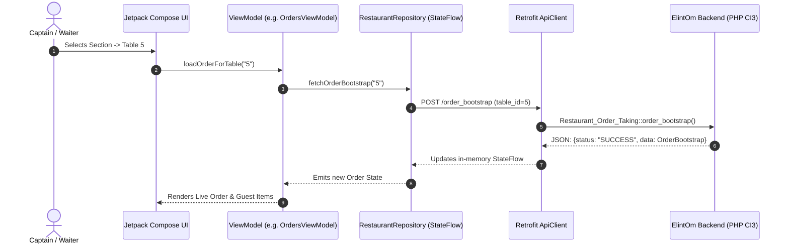

# 📱 Order Taking Android App — Comprehensive Deep-Dive Documentation

## 1. 🏗️ Tech Stack & Architecture

### **Core Technology Stack**
| Layer | Technologies / Libraries |
| :--- | :--- |
| **Language & Runtime** | Kotlin 2.0+, JDK 11, Kotlin Coroutines & Flow |
| **UI Framework** | Jetpack Compose (Declarative UI) + Material 3 (M3) Design System |
| **Architecture Pattern**| **MVVM (Model-View-ViewModel)** with Single Source of Truth (`StateFlow`) |
| **Networking & HTTP** | Retrofit 2 + OkHttp 4 + Moshi (JSON Serialization with KSP Codegen) |
| **Image Loading** | Coil Compose (`AsyncImage`) |
| **Local Storage / Config**| SharedPreferences / `ApiSettingsManager` (Dynamic Server URL & Port) |
| **Testing & Mocking** | Robolectric, Roborazzi (Screenshot testing), JUnit 4, Compose UI Test |

---

## 2. 📂 Detailed Folder & File Structure

```
c:\wamp64\www\order_taking\
├── app/
│   ├── build.gradle.kts                # Build configs, compileSdk 36, KSP plugins, signing configs
│   ├── src/main/
│   │   ├── AndroidManifest.xml         # Internet permission, Main Activity declaration
│   │   ├── java/com/example/
│   │   │   ├── MainActivity.kt         # Android Entry point, Surface & AppNavigation host
│   │   │   │
│   │   │   ├── data/                   # 📦 DATA LAYER
│   │   │   │   ├── api/
│   │   │   │   │   ├── ApiClient.kt            # Singleton OkHttpClient + Retrofit builder with dynamic base URL
│   │   │   │   │   ├── ApiSettingsManager.kt   # Saves IP, Port, Protocol (HTTP/HTTPS) in SharedPreferences
│   │   │   │   │   └── RestaurantApiService.kt # 25+ Retrofit endpoints matching backend PHP API
│   │   │   │   ├── model/
│   │   │   │   │   └── Models.kt               # Moshi JSON Data classes (Section, Table, OrderItem, Customization, etc.)
│   │   │   │   └── repository/
│   │   │   │       ├── AuthRepository.kt       # Login, Logout, Forgot Password, Branding info
│   │   │   │       └── RestaurantRepository.kt # Central State Repository with offline fallback data
│   │   │   │
│   │   │   └── ui/                     # 🎨 UI & PRESENTATION LAYER
│   │   │       ├── navigation/
│   │   │       │   └── AppNavigation.kt        # NavHost, Routes definition, argument passing & stack control
│   │   │       ├── theme/
│   │   │       │   ├── Color.kt                # Brand palette (#E9176B Primary pink/red, status colors)
│   │   │       │   ├── Theme.kt                # Material3 Dark/Light Theme Provider
│   │   │       │   └── Type.kt                 # Typography definitions
│   │   │       ├── components/                 # 🧩 REUSABLE UI COMPONENTS
│   │   │       │   ├── TopHeaderBar.kt         # Global app header (Brand logo, active table, settings, logout)
│   │   │       │   ├── SharedTabStrip.kt       # 3 Main navigation tabs (Sections, Tables, Orders)
│   │   │       │   ├── TableCard.kt            # Interactive Table Cards with color-coded status badges & guest count
│   │   │       │   ├── InvoiceDialog.kt        # Thermal receipt / Bill preview dialog with item breakdown
│   │   │       │   └── SettingsDialog.kt       # Server IP / Port / Base URL live configuration dialog
│   │   │       └── screens/                    # 🖥️ SCREEN MODULES
│   │   │           ├── auth/                   # Authentication Flow
│   │   │           │   ├── SplashScreen.kt & SplashViewModel.kt
│   │   │           │   ├── LoginScreen.kt & LoginViewModel.kt
│   │   │           │   ├── ForgotPasswordScreen.kt
│   │   │           │   └── RegisterInfoScreen.kt
│   │   │           ├── sections/               # Floor / Section Selection
│   │   │           │   ├── SectionsScreen.kt
│   │   │           │   └── SectionsViewModel.kt
│   │   │           ├── tables/                 # Table Grid & Status Screen
│   │   │           │   ├── TablesScreen.kt
│   │   │           │   └── TablesViewModel.kt
│   │   │           ├── menu/                   # Menu, Search, Category & Item Customization
│   │   │           │   ├── MenuScreen.kt
│   │   │           │   └── MenuViewModel.kt
│   │   │           ├── orders/                 # Order Hub (Active KOTs, Guest-wise Cart)
│   │   │           │   ├── OrdersScreen.kt
│   │   │           │   └── OrdersViewModel.kt
│   │   │           └── finalize/               # Bill Review, Print & Table Release
│   │   │               ├── FinalizeScreen.kt
│   │   │               └── FinalizeViewModel.kt
│   │   └── res/                                # XML Drawables, App Icons, Strings, Colors
│   └── proguard-rules.pro
├── .env / .env.example                         # Gradle secrets & API URLs
└── settings.gradle.kts                         # Dependency resolution management
```

---

## 3. 🖥️ Screen-by-Screen Breakdown & Functionality

### 1️⃣ **Authentication (`ui/screens/auth/`)**
* **`SplashScreen`**:
  * Loads dynamic brand logo, company name, and primary theme colors from backend (`GET branding`).
  * Checks login session in `AuthRepository`. If logged in -> navigates to `SECTIONS`, else -> `LOGIN`.
* **`LoginScreen`**:
  * Username/Email & Password input fields with role selector (Captain, Manager, Waiter).
  * Server connection health status badge.
  * Direct access to **Server Settings Dialog** (to configure local server IP e.g. `192.168.1.100/ElintOm_PHP_8.5`).
* **`ForgotPasswordScreen` & `RegisterInfoScreen`**:
  * Self-service password reset request & admin contact instructions.

---

### 2️⃣ **Sections Screen (`ui/screens/sections/`)**
* Displays all restaurant dining areas (e.g. *Main Dining, AC Hall, Family Section, Rooftop, Garden, Bar*).
* Shows badge with number of sub-sections and active tables.
* Top bar with navigation tabs: `[ SECTIONS | TABLES | ORDERS ]`.
* Clicking a section opens the **Tables Screen** for that section.

---

### 3️⃣ **Tables Screen (`ui/screens/tables/`)**
* Displays grid of tables for the selected section/subsection.
* **Color-Coded Statuses:**
  * 🟢 **Available / Free** (`#2E7D32`) — Ready for new guests.
  * 🔴 **Occupied** (`#C2185B`) — Guests seated, active order in progress.
  * 🟡 **Order Placed / KOT Sent** (`#E65100`) — Sent to kitchen, food preparing.
  * 🔵 **Ready** (`#0288D1`) — Food prepared in kitchen, ready to be served.
  * 🟣 **Reserved** (`#7B1FA2`) — Booked table.
* **Quick Table Actions:**
  * Click table -> Opens **Order Hub (`OrdersScreen`)** for this table.
  * Long press / Action menu: *Reserve Table, Free Table, Mark Occupied, Clear Table*.

---

### 4️⃣ **Menu & Ordering Screen (`ui/screens/menu/`)**
* **Category Filter Strip:** Horizontal scroll of categories (Starters, Main Course, Breads, Drinks, Desserts).
* **Live Search & Filter:** Instant search by item name + Veg / Non-Veg toggle.
* **Item Customization Modal (Bottom Sheet / Dialog):**
  * **Guest Allocation:** Assign dish to specific Guest (Guest 1, Guest 2, etc.).
  * **Spice Level Selector:** Mild, Medium, Spicy, Extra Hot.
  * **Meat Wellness (if non-veg):** Rare, Medium Rare, Medium, Well Done.
  * **Allergies Checkboxes:** Peanuts, Gluten, Dairy, Soy, Shellfish + Custom allergy text input.
  * **No Onion / No Garlic Flags:** One-tap Jain / Satvik dietary toggles.
  * **Add-ons & Toppings:** Extra Cheese, Extra Dip, Custom sides with prices.
  * **Special Cooking Instructions:** Text area for custom chef notes.
* **Add to Cart:** Synchronously calls `POST add_item` and updates live order.

---

### 5️⃣ **Orders Hub Screen (`ui/screens/orders/`)**
* **Guest-Wise Order View:** Tabbed or accordion view showing items grouped by Guest (`Guest 1`, `Guest 2`, etc.).
* **Guest Management:** `[ + Add Guest ]` and `[ - Remove Guest ]` dynamic controls.
* **Item Actions:**
  * Quantity increment (`+`) / decrement (`-`).
  * Delete item.
  * Item status badge (*Pending*, *KOT Sent*, *Preparing*, *Ready*, *Served*).
* **Primary Order Actions:**
  * **`+ Add More Items`** -> Navigates to `MenuScreen`.
  * **`🔥 Fire KOT / Send to Kitchen`** -> Calls `POST update_kot_status`, alerts Kitchen Display System (KDS).
  * **`🍽️ Mark Served`** -> Updates order stage.
  * **`💳 Finalize / Bill`** -> Navigates to `FinalizeScreen`.

---

### 6️⃣ **Finalize & Billing Screen (`ui/screens/finalize/`)**
* **Order Summary:** Complete list of all items ordered across all guests.
* **Financial Calculations:** Subtotal, GST/Taxes, Service Charges, Discounts, Grand Total.
* **Finalize Order Action:** Calls `POST finalize_order` -> Generates official POS Sale ID in `ElintOm_PHP_8.5`.
* **Invoice Receipt Preview (`InvoiceDialog`):**
  * Shows 80mm/58mm thermal receipt format.
  * Restaurant header, Table number, Captain name, Items table, GST summary.
* **`Complete & Free Table`**: Releases table status back to *Available/Free*.

---

## 4. ⚙️ Data Flow & State Management



---

## 5. 🔌 Backend API Integration Reference (`RestaurantApiService.kt` <-> CI3)

| HTTP Method | Android API Endpoint | Backend Controller Method (`Restaurant_Order_Taking.php`) | Purpose |
| :--- | :--- | :--- | :--- |
| `GET` | `branding` | `branding()` | Dynamic App Logo, Name & Primary Brand Color |
| `POST` | `login` | `login()` | Waiter/Captain Authentication |
| `GET` | `sections` | `sections()` | List all restaurant sections |
| `POST` | `subsections` | `subsections()` | Subsections for a specific section |
| `POST` | `tables` | `tables()` | Tables list with statuses |
| `POST` | `order_bootstrap` | `order_bootstrap()` | Complete order details, items & guests for table |
| `POST` | `create_order` | `create_order()` | Create new active table order |
| `GET` | `menu_categories` | `menu_categories()` | List food menu categories |
| `POST` | `menu_items` | `menu_items()` | List dishes with price & veg status |
| `POST` | `product_customizations`| `product_customizations()`| Add-ons, spice levels, allergies for product |
| `POST` | `add_item` | `add_item()` | Add item with customizations to guest order |
| `POST` | `update_item` | `update_item()` | Update quantity / customization |
| `POST` | `delete_item` | `delete_item()` | Remove item from order |
| `POST` | `update_kot_status`| `update_kot_status()` | Fire KOT to Kitchen Display (KDS) |
| `POST` | `finalize_order` | `finalize_order()` | Convert order into POS Sale record |
| `POST` | `complete_and_free` | `complete_and_free()` | Close order and make table free |

---

## 6. 💡 Resiliency & Offline Fallback Feature

In `RestaurantRepository.kt`:
* If WAMP / PHP backend server is unreachable (network timeout / WiFi disconnect), the repository does not crash.
* It uses **built-in mock fallbacks** (`getInitialSections()`, `getInitialTables()`, `getInitialCategories()`) so the UI stays responsive and allows seamless testing even without a live backend connection.
