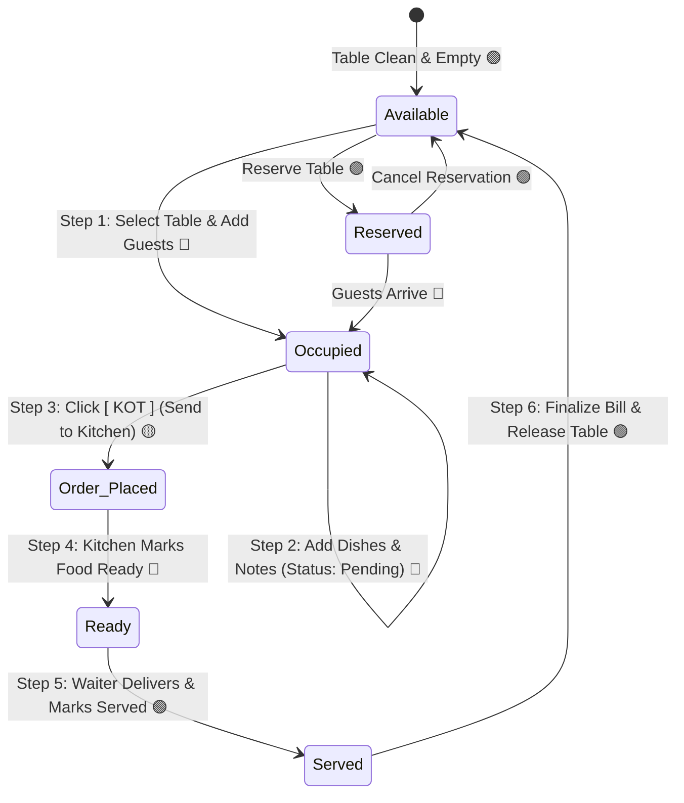

# 📱 Complete Order Taking Lifecycle Flow & Database Impact Documentation

This document explains the complete, end-to-end lifecycle of the **Restaurant Order Taking System**, covering every screen action, table status transitions, UI color codes, and the exact database tables & columns affected at each step.

---

## 🎨 1. Table Status & Color Master Reference

| Status ID | Status Value | UI Color | HEX Code | Table State Meaning |
| :--- | :--- | :--- | :--- | :--- |
| **`1`** | **Available** | 🟢 **Green** | `#2E7D32` | Table is empty and ready for new guests |
| **`2`** | **Occupied** | 🔴 **Pink / Red** | `#C2185B` | Guests seated, active order in progress |
| **`3`** | **Reserved** | 🟣 **Purple** | `#7B1FA2` | Table is booked for future reservation |
| **`7`** | **Order Placed (KOT)** | 🟡 **Orange** | `#E65100` | KOT fired, food is preparing in kitchen |
| **`4`** | **Ready** | 🔵 **Blue** | `#0288D1` | Food is cooked and ready to be served |
| **`8`** | **Served** | 🟢 **Green Light**| `#00897B` | Food served to guests on the table |

---

## 🔄 2. Complete Order Lifecycle State Diagram



---

## 📋 3. Step-by-Step Lifecycle & Database Impact

---

### 🟢 Step 1: Select Table & Seat Guests
* **User Action:** Captain taps on an available table on the Tables screen (e.g., Table 1 with 3 guests).
* **UI Transition:** Table card changes from 🟢 **Available (`#2E7D32`)** to 🔴 **Occupied (`#C2185B`)**.
* **API Endpoint:** `POST /create_order`

#### 🗄️ Database Changes:
| Table Name | Operation | Columns Affected | Example Values |
| :--- | :--- | :--- | :--- |
| **`sma_res_orders`** | **INSERT ➕** | `id`, `res_tables_id`, `guest_count`, `status`, `payment_status`, `created_at` | `id=501, res_tables_id=1, guest_count=3, status='Active', payment_status='Pending'` |
| **`sma_res_orders_guests`** | **INSERT ➕** | `id`, `res_orders_id`, `created_at` | `(1, 501), (2, 501), (3, 501)` |
| **`sma_res_tables`** | **UPDATE 🔄** | `status_id`, `guests_count`, `updated_at` | `status_id=2 (Occupied), guests_count=3` |

---

### 🍔 Step 2: Add Menu Items & Customizations
* **User Action:** Captain opens Menu, selects dishes, customizes spice level (Mild/Medium/Spicy), selects add-ons (Extra Cheese), assigns to a specific Guest or All Guests (Table Common), and taps **"Add to Order"**.
* **UI Transition:** Item appears in the Orders Hub accordion list with status badge `Pending`.
* **API Endpoint:** `POST /add_item`

#### 🗄️ Database Changes:
| Table Name | Operation | Columns Affected | Example Values |
| :--- | :--- | :--- | :--- |
| **`sma_res_orders_items`** | **INSERT ➕** | `res_orders_id`, `res_orders_guests_id`, `sma_product_id`, `quantity`, `unit_price`, `amount`, `spice_level`, `on_add_on_id`, `special_instructions`, `status`, `created_at` | `res_orders_id=501, res_orders_guests_id=1, sma_product_id=45 (Paneer Tikka), quantity=1, unit_price=240.00, amount=270.00, spice_level='Medium', on_add_on_id='1' (Extra Cheese), status='Pending'` |
| **`sma_res_orders`** | **UPDATE 🔄** | `updated_at` | Timestamps updated |

---

### 🟡 Step 3: Fire KOT to Kitchen (Click [ KOT ] Button)
* **User Action:** Captain verifies all guest items on `OrdersScreen` and taps the primary **`[ KOT ]`** button.
* **UI Transition:** 
  * Table status transitions to 🟡 **Order Placed / Kitchen (`#E65100`)**.
  * Item status badges change from `Pending` to `KOT Sent`.
* **API Endpoint:** `POST /update_kot_status`

#### 🗄️ Database Changes:
| Table Name | Operation | Columns Affected | Example Values |
| :--- | :--- | :--- | :--- |
| **`sma_res_orders_items`** | **UPDATE 🔄** | `status`, `updated_at` | `status='kot'` (for all pending items in order 501) |
| **`sma_res_orders`** | **UPDATE 🔄** | `status`, `updated_at` | `status='Order Placed'` |
| **`sma_res_tables`** | **UPDATE 🔄** | `status_id`, `updated_at` | `status_id=7` (Order Placed / Kitchen 🟡) |
| **`sma_suspended_bills`** | **INSERT ➕** | `date`, `customer_id`, `total`, `note` | KDS ticket created for Kitchen Display Screen |

---

### 🔵 Step 4: Kitchen Marks Order Ready
* **Action:** Chef in the kitchen finishes cooking and marks the KOT as "Ready" on the KDS tablet.
* **UI Transition:** Table status transitions to 🔵 **Ready (`#0288D1`)**. Captain's bottom action button switches to green **`[ Served ]`**.
* **API Endpoint:** `POST /order_ready`

#### 🗄️ Database Changes:
| Table Name | Operation | Columns Affected | Example Values |
| :--- | :--- | :--- | :--- |
| **`sma_res_orders_items`** | **UPDATE 🔄** | `status` | `status='ready'` |
| **`sma_res_orders`** | **UPDATE 🔄** | `status` | `status='Ready'` |
| **`sma_res_tables`** | **UPDATE 🔄** | `status_id` | `status_id=4` (Ready 🔵) |

---

### 🟢 Step 5: Waiter Serves Food (Click [ Served ] Button)
* **User Action:** Waiter delivers the food to the table and taps **`[ Served ]`**.
* **UI Transition:** Table status transitions to 🟢 **Served (`#00897B`)**.
* **API Endpoint:** `POST /mark_served`

#### 🗄️ Database Changes:
| Table Name | Operation | Columns Affected | Example Values |
| :--- | :--- | :--- | :--- |
| **`sma_res_orders_items`** | **UPDATE 🔄** | `status` | `status='served'` |
| **`sma_res_orders`** | **UPDATE 🔄** | `status` | `status='Served'` |
| **`sma_res_tables`** | **UPDATE 🔄** | `status_id` | `status_id=8` (Served 🟢) |

---

### 💳 Step 6: Finalize Order & Free Table
* **User Action:** Captain reviews final bill breakdown (Subtotal + GST/Taxes), taps **`[ Finalize Order ]`**, previews 80mm thermal invoice receipt, and taps **`[ Complete & Free Table ]`**.
* **UI Transition:**
  * Official POS Sale ID is generated.
  * Table status resets back to 🟢 **Available (`#2E7D32`)**.
* **API Endpoint:** `POST /finalize_order` & `POST /complete_and_free`

#### 🗄️ Database Changes:
| Table Name | Operation | Columns Affected | Example Values |
| :--- | :--- | :--- | :--- |
| **`sma_sales`** | **INSERT ➕** | `reference_no`, `customer_id`, `biller_id`, `total`, `total_tax`, `grand_total`, `sale_status`, `payment_status`, `date` | `reference_no='SALE/2026/08/012', total=790.00, total_tax=39.50, grand_total=829.50, sale_status='completed', payment_status='paid'` |
| **`sma_sale_items`** | **INSERT ➕** | `sale_id`, `product_id`, `product_name`, `quantity`, `unit_price`, `subtotal` | Insert row for each ordered dish |
| **`sma_res_orders`** | **UPDATE 🔄** | `status`, `payment_status` | `status='Completed', payment_status='Paid'` |
| **`sma_res_tables`** | **UPDATE 🔄** | `status_id`, `guests_count` | `status_id=1` (Available 🟢), `guests_count=0` |

---

## 📊 4. Master Summary Table

```
+---------------------------------------------------------------------------------------------------------------+
| Step | Screen / Action            | Table Status  | Color       | Primary DB Tables Affected                  |
+---------------------------------------------------------------------------------------------------------------+
| 1    | Select Table / Seating     | Occupied      | 🔴 #C2185B  | sma_res_orders (INS), sma_res_tables (UPD)  |
| 2    | Add Item to Guest / All    | Occupied      | 🔴 #C2185B  | sma_res_orders_items (INS status=Pending)   |
| 3    | Fire KOT (Send to Kitchen) | Order Placed  | 🟡 #E65100  | sma_res_orders_items (UPD status=kot),      |
|      |                            |               |             | sma_res_tables (UPD status_id=7)            |
| 4    | Kitchen Food Ready         | Ready         | 🔵 #0288D1  | sma_res_orders (UPD), sma_res_tables (UPD)  |
| 5    | Food Served to Table       | Served        | 🟢 #00897B  | sma_res_orders (UPD), sma_res_tables (UPD)  |
| 6    | Finalize Bill & Free Table | Available     | 🟢 #2E7D32  | sma_sales (INS), sma_sale_items (INS),      |
|      |                            |               |             | sma_res_tables (UPD status_id=1)            |
+---------------------------------------------------------------------------------------------------------------+
```
