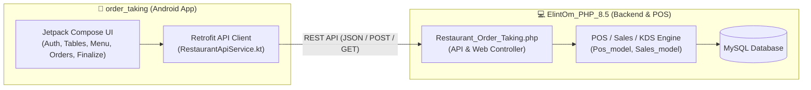

# Project Architecture & Directory Structure Guide

## 🌐 Overview & Ecosystem Connection



---

## 1️⃣ `ElintOm_PHP_8.5` (Backend ERP & Web POS)

- **Tech Stack:** PHP 8.x, CodeIgniter 3 (MVC Architecture), MySQL, Bootstrap, jQuery
- **Purpose:** Central ERP, Billing, Point of Sale (POS), Kitchen Display System (KDS), Inventory & Multi-channel Order Management.

### Directory Structure
```
c:\wamp64\www\ElintOm_PHP_8.5\
├── app/
│   ├── config/                     # Database, routes, app constants
│   ├── controllers/                # 80+ Controllers handling modules & APIs
│   │   ├── Restaurant_Order_Taking.php # 🎯 Captain/Waiter App Backend API
│   │   ├── Pos.php / Pos_elite.php # POS Terminals & Billing
│   │   ├── Sales.php / Orders.php  # Sales & Orders Management
│   │   ├── Products.php            # Catalog, Variants, Stock, Recipes
│   │   ├── Urban_piper.php         # Swiggy / Zomato Aggregator Integration
│   │   └── Api.php / Restapi5.php  # General REST APIs for mobile/external
│   ├── models/                     # Business logic & MySQL queries
│   │   ├── Restaurant_Order_Taking_model.php
│   │   ├── Pos_model.php / Sales_model.php
│   │   └── Products_model.php
│   ├── views/                      # UI Views for Admin & POS Panels
│   ├── libraries/                  # Custom CI libraries
│   ├── helpers/                    # Helper functions
│   └── logs/                       # System application logs
├── database/                       # SQL schema dumps & migration files
├── system/                         # CodeIgniter 3 core framework files
└── themes/                         # Front-end CSS, JS, Images, and Assets
```

---

## 2️⃣ `order_taking` (Captain / Waiter Android App)

- **Tech Stack:** Android Kotlin, Jetpack Compose, Retrofit 2, OkHttp, Kotlin Coroutines, Material 3
- **Purpose:** Waiter / Captain tablet and mobile app for instant table management, taking customer orders, sending KOTs directly to kitchen, and finalizing bills.

### Directory Structure
```
c:\wamp64\www\order_taking\
├── app/src/main/
│   ├── AndroidManifest.xml         # App permissions & components
│   ├── java/com/example/
│   │   ├── MainActivity.kt         # Entry point & root navigation
│   │   ├── data/
│   │   │   ├── api/                # Network / Retrofit Layer
│   │   │   │   ├── ApiClient.kt            # Base URL & HTTP Client config
│   │   │   │   ├── RestaurantApiService.kt # 25+ Retrofit Endpoints
│   │   │   │   └── ApiSettingsManager.kt   # IP & Server URL persistence
│   │   │   ├── model/              # Data classes (Order, Table, Menu, etc.)
│   │   │   └── repository/         # Data repositories & state managers
│   │   └── ui/                     # Jetpack Compose UI
│   │       ├── screens/
│   │       │   ├── auth/           # Login & Shift Register Screen
│   │       │   ├── sections/       # Floor/Section Selector (e.g. AC, Garden, Rooftop)
│   │       │   ├── tables/         # Table Grid & Status (Occupied, Free, Reserved)
│   │       │   ├── menu/           # Category, Menu Items, Add-ons, Customization
│   │       │   ├── orders/         # Active KOTs, Guest-wise Cart & Item Notes
│   │       │   └── finalize/       # Order Review, Bill Calculation & Payment
│   │       ├── components/         # Common UI elements (Dialogs, Buttons, Badges)
│   │       ├── navigation/         # Compose Navigation Routes & Destinations
│   │       └── theme/              # Typography, Color Palette, Shapes (Material 3)
│   └── res/                        # Drawables, layouts, mipmap icons, values
├── build.gradle.kts                # Project dependencies & build config
└── .env                            # Local configuration (Base URL / API Key)
```

---

## 🔄 Interaction & Data Flow

1. **Table Selection:** Waiter selects Section -> Table in `order_taking` app (`GET /sections`, `POST /tables`).
2. **Order Taking & Customization:** Waiter adds items with guest IDs, spice levels, allergies, notes (`POST /add_item`).
3. **KOT Generation:** Waiter fires KOT (`POST /update_kot_status`) -> `ElintOm_PHP_8.5` creates KDS entry & updates table status.
4. **Billing & Finalize:** Waiter reviews summary and finalizes order (`POST /finalize_order`, `POST /complete_and_free`).
