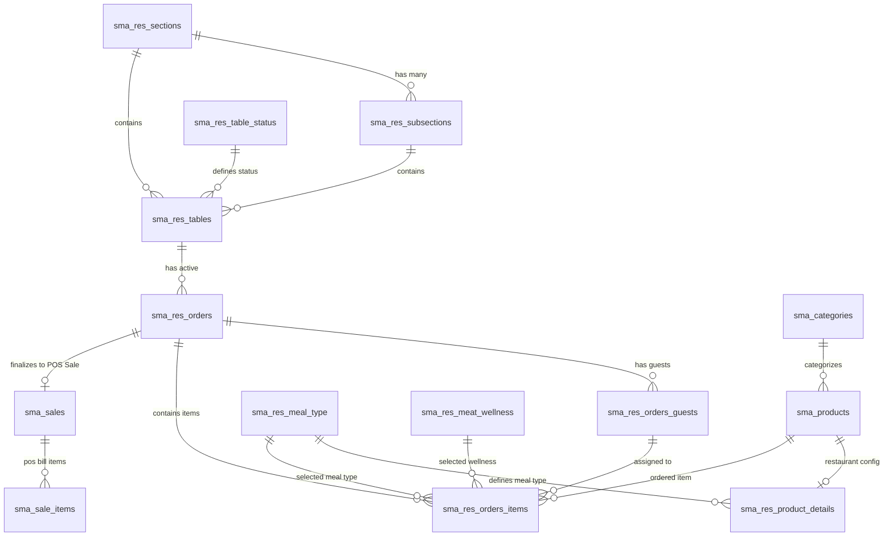

# 🍽️ Restaurant Order Taking — Database Architecture & Schema Documentation

या डॉक्युमेंटमध्ये **Restaurant Order Taking System (`res_order_taking` + `ElintOm_PHP_8.5`)** साठी वापरल्या जाणाऱ्या सर्व MySQL डेटाबेस टेबल्स, त्यांचे कॉलम्स, डेटा टाईप्स, संबंध (Relationships) आणि ॲप फ्लो मधील वापर सविस्तर दिलेला आहे.

---

## 📊 1. Entity-Relationship (ER) Architecture Diagram



---

## 📋 2. Comprehensive Tables List & Descriptions

### 🏗️ A. Table & Dining Floor Management (टेबल आणि फ्लोअर व्यवस्थापन)

#### 1. `sma_res_sections` (रेस्टॉरंट सेक्शन्स / फ्लोअर्स)
* **उद्देश:** रेस्टॉरंटचे प्रमुख विभाग (उदा. Main AC Hall, Garden, Rooftop, Family Section).
| Column Name | Data Type | Key | Description |
| :--- | :--- | :--- | :--- |
| `id` | `INT(11)` | PK, AI | युनिक सेक्शन आयडी |
| `name` | `VARCHAR(100)` | | विभागाचे नाव (उदा. "Main Dining", "Garden Area") |
| `is_active` | `TINYINT(1)` | | 1 = Active, 0 = Inactive |
| `created_at` | `DATETIME` | | तयार केल्याची तारीख व वेळ |
| `updated_at` | `DATETIME` | | अपडेट वेळ |

#### 2. `sma_res_subsections` (सब-सेक्शन्स / रूम्स / झोन्स)
* **उद्देश:** सेक्शन अंतर्गत असलेले उपविभाग (उदा. AC Hall मधील "Hall A", "Hall B", "VIP Lounge").
| Column Name | Data Type | Key | Description |
| :--- | :--- | :--- | :--- |
| `id` | `INT(11)` | PK, AI | युनिक सब-सेक्शन आयडी |
| `section_id` | `INT(11)` | FK | मुख्य सेक्शनचा reference (`sma_res_sections.id`) |
| `name` | `VARCHAR(100)` | | सब-सेक्शन नाव (उदा. "Hall A", "Balcony") |
| `is_active` | `TINYINT(1)` | | 1 = Active, 0 = Inactive |

#### 3. `sma_res_tables` (डायनिंग टेबल्स)
* **उद्देश:** रेस्टॉरंटमधील सर्व प्रत्यक्ष टेबल्सची यादी आणि त्यांची चालू स्थिती.
| Column Name | Data Type | Key | Description |
| :--- | :--- | :--- | :--- |
| `id` | `INT(11)` | PK, AI | युनिक टेबल आयडी |
| `name` | `VARCHAR(50)` | | टेबल नंबर / नाव (उदा. "Table 1", "T-05") |
| `section_id` | `INT(11)` | FK | सेक्शन आयडी |
| `subsection_id` | `INT(11)` | FK | सब-सेक्शन आयडी |
| `status_id` | `INT(11)` | FK | टेबल स्थिती आयडी (`sma_res_table_status.id`) |
| `guests_count` | `INT(11)` | | टेबलची क्षमता / चालू बसलेले गेस्ट्स |
| `reserved_by` | `VARCHAR(100)`| | कोणासाठी रिझर्व्ह केले आहे त्याचे नाव |
| `reserved_until` | `DATETIME` | | किती वेळेपर्यंत रिझर्व्ह आहे |
| `reserved_note` | `TEXT` | | रिझर्व्हेशन संदर्भात टीप |
| `is_active` | `TINYINT(1)` | | 1 = Active, 0 = Inactive |

#### 4. `sma_res_table_status` (टेबल स्टेटस मास्टर)
* **उद्देश:** टेबलची स्थिती व कलर कोडिंग (Available, Occupied, Order Placed, Ready, Reserved).
| Column Name | Data Type | Key | Description |
| :--- | :--- | :--- | :--- |
| `id` | `INT(11)` | PK, AI | स्टेटस आयडी (उदा. 1=Available, 2=Occupied, 3=Reserved) |
| `value` | `VARCHAR(50)` | | स्थितीचे नाव ("Available", "Occupied", "Order Placed", "Ready", "Served", "Reserved") |
| `color` | `VARCHAR(20)` | | UI वरील HEX Color कोड (उदा. `#2E7D32`, `#C2185B`, `#E65100`) |

---

### 📝 B. Order & Multi-Guest Management (ऑर्डर आणि गेस्ट व्यवस्थापन)

#### 5. `sma_res_orders` (चालू टेबल ऑर्डर्स)
* **उद्देश:** कोणत्याही टेबलवर चालू असलेल्या रनिंग ऑर्डरचा मुख्य रेकॉर्ड.
| Column Name | Data Type | Key | Description |
| :--- | :--- | :--- | :--- |
| `id` | `INT(11)` | PK, AI | युनिक ऑर्डर आयडी (उदा. `101`) |
| `res_tables_id` | `INT(11)` | FK | ज्या टेबलवर ऑर्डर चालू आहे त्याचा आयडी (`sma_res_tables.id`) |
| `guest_count` | `INT(11)` | | टेबलवर बसलेल्या एकूण गेस्ट्सची संख्या (उदा. 2, 4, 6) |
| `status` | `VARCHAR(30)` | | `Active`, `Order Placed`, `Ready`, `Served`, `Completed`, `Cancelled` |
| `payment_status`| `VARCHAR(30)` | | `Pending`, `Paid`, `Partial` |
| `sgst_percent` | `DECIMAL(5,2)`| | SGST टॅक्स टक्केवारी (उदा. 2.50%) |
| `cgst_percent` | `DECIMAL(5,2)`| | CGST टॅक्स टक्केवारी (उदा. 2.50%) |
| `created_at` | `DATETIME` | | ऑर्डर सुरू केल्याची तारीख व वेळ |
| `updated_at` | `DATETIME` | | शेवटची अपडेट वेळ |

#### 6. `sma_res_orders_guests` (ऑर्डर मधील गेस्ट्सची यादी)
* **उद्देश:** एकाच टेबलवरील प्रत्येक स्वतंत्र गेस्ट (Guest 1, Guest 2, Guest 3) चा ट्रॅकिंग रेकॉर्ड.
| Column Name | Data Type | Key | Description |
| :--- | :--- | :--- | :--- |
| `id` | `INT(11)` | PK, AI | युनिक गेस्ट रो आयडी |
| `res_orders_id` | `INT(11)` | FK | मुख्य ऑर्डरचा reference (`sma_res_orders.id`) |
| `created_at` | `DATETIME` | | गेस्ट जोडल्याची तारीख व वेळ |

#### 7. `sma_res_orders_items` (ऑर्डर मधील आयटम्स आणि कस्टमायझेशन)
* **उद्देश:** प्रत्येक गेस्टने किंवा सर्व गेस्ट्सने (Table Common) मागवलेले पदार्थ, प्रमाण आणि कुकिंग सूचना.
| Column Name | Data Type | Key | Description |
| :--- | :--- | :--- | :--- |
| `id` | `INT(11)` | PK, AI | युनिक ऑर्डर आयटम आयडी |
| `res_orders_id` | `INT(11)` | FK | मुख्य ऑर्डर आयडी (`sma_res_orders.id`) |
| `res_orders_guests_id`| `INT(11)` | FK | गेस्ट आयडी (`0` = Table Common / All Guests, किंवा `sma_res_orders_guests.id`) |
| `sma_product_id` | `INT(11)` | FK | प्रॉडक्ट / डिश आयडी (`sma_products.id`) |
| `quantity` | `DECIMAL(10,2)`| | पदार्थांची संख्या (Quantity) |
| `unit_price` | `DECIMAL(15,2)`| | प्रति नग मूळ दर |
| `amount` | `DECIMAL(15,2)`| | एकूण रक्कम (`(unit_price + add_ons) * quantity`) |
| `meal_type_id` | `INT(11)` | FK | व्हेज (1) / नॉन-व्हेज (2) आयडी |
| `sma_res_meat_wellness_id`| `INT(11)` | FK | Rare / Medium / Well Done आयडी |
| `spice_level` | `VARCHAR(30)` | | तिखटपणाची पातळी (`Mild`, `Medium`, `Spicy`, `Extra Hot`) |
| `allergies` | `TEXT` | | ॲलर्जीची नावे (उदा. "Peanut, Gluten") |
| `add_ons` | `TEXT` | | निवडलेले ॲड-ऑन्स आयडी किंवा नावे (उदा. "Extra Cheese") |
| `toppings` | `TEXT` | | निवडलेले टॉपिंग्स (उदा. "Mushroom, Olives") |
| `onion_flag` | `TINYINT(1)` | | 1 = No Onion (कांदा नाही), 0 = Normal |
| `garlic_flag` | `TINYINT(1)` | | 1 = No Garlic (लसूण नाही), 0 = Normal |
| `special_instructions`| `TEXT` | | शेफसाठी विशेष सूचना (उदा. "Less oil, make crispy") |
| `status` | `VARCHAR(30)` | | आयटम स्थिती (`pending`, `kot`, `preparing`, `ready`, `served`) |
| `created_at` | `DATETIME` | | ॲड केल्याची वेळ |

---

### 🍔 C. Menu Catalog & Product Configuration (मेन्यू कॅटलॉग आणि प्रॉडक्ट कॉन्फिगरेशन)

#### 8. `sma_categories` (मेन्यू कॅटेगरीज)
* **उद्देश:** मेन्यू वर्गीकरण (उदा. Starters, Main Course, Breads, Drinks, Desserts).
| Column Name | Data Type | Key | Description |
| :--- | :--- | :--- | :--- |
| `id` | `INT(11)` | PK, AI | कॅटेगरी आयडी |
| `name` | `VARCHAR(100)` | | कॅटेगरी नाव (उदा. "Chinese Starters", "Beverages") |
| `image` | `VARCHAR(255)` | | कॅटेगरी आयकॉन / इमेज पाथ |

#### 9. `sma_products` (प्रॉडक्ट्स / डिशेस मास्टर)
* **उद्देश:** रेस्टॉरंटमधील सर्व खाद्यपदार्थ आणि पेयांची मूळ यादी.
| Column Name | Data Type | Key | Description |
| :--- | :--- | :--- | :--- |
| `id` | `INT(11)` | PK, AI | प्रॉडक्ट आयडी |
| `code` | `VARCHAR(50)` | | प्रॉडक्ट आयटम कोड (उदा. "P101", "BUR01") |
| `name` | `VARCHAR(255)` | | पदार्थाचे नाव (उदा. "Paneer Tikka", "Butter Chicken") |
| `category_id` | `INT(11)` | FK | कॅटेगरी आयडी (`sma_categories.id`) |
| `price` | `DECIMAL(15,2)`| | मूळ बेस प्राईस |
| `image` | `VARCHAR(255)` | | पदार्थाचा फोटो / इमेज फाईल नाव |
| `flag_visible` | `TINYINT(1)` | | 1 = POS व ॲपवर दिसेल, 0 = लपवलेला |

#### 10. `sma_res_product_details` (रेस्टॉरंट-विशिष्ट प्रॉडक्ट सेटिंग्ज)
* **उद्देश:** एखाद्या प्रॉडक्टचा रेस्टॉरंट डायनिंग दर आणि Meal Type मॅपिंग.
| Column Name | Data Type | Key | Description |
| :--- | :--- | :--- | :--- |
| `id` | `INT(11)` | PK, AI | आयडी |
| `product_id` | `INT(11)` | FK | प्रॉडक्ट आयडी (`sma_products.id`) |
| `meal_type_id` | `INT(11)` | FK | Meal Type आयडी (1=Veg, 2=Non-Veg, 3=Egg, etc.) |
| `price` | `DECIMAL(15,2)`| | रेस्टॉरंट डायनिंग प्राईस (Override Base Price) |
| `is_active` | `TINYINT(1)` | | 1 = Active, 0 = Inactive |

---

### 🌶️ D. Customization & Dietary Masters (कस्टमायझेशन आणि डाएट मास्टर्स)

#### 11. `sma_res_meal_type` (मील टाईप मास्टर)
* **उद्देश:** व्हेज, नॉन-व्हेज, एग्गेटेरियन वर्गीकरण.
| Column Name | Data Type | Key | Description |
| :--- | :--- | :--- | :--- |
| `id` | `INT(11)` | PK, AI | 1 = Veg, 2 = Non-Veg, 3 = Egg |
| `name` | `VARCHAR(50)` | | "Veg", "Non-Veg", "Egg" |
| `is_active` | `TINYINT(1)` | | 1 = Active |

#### 12. `sma_res_meat_wellness` (नॉन-व्हेज कुकिंग वेलनेस)
* **उद्देश:** मटण/चिकन/बीफ स्टेक साठी वेलनेस लेव्हल (Rare, Medium, Well Done).
| Column Name | Data Type | Key | Description |
| :--- | :--- | :--- | :--- |
| `id` | `INT(11)` | PK, AI | आयडी |
| `type` | `VARCHAR(50)` | | "Rare", "Medium Rare", "Medium", "Well Done" |
| `is_active` | `TINYINT(1)` | | 1 = Active |

#### 13. `sma_res_common_allergies` (ॲलर्जी मास्टर)
* **उद्देश:** ग्राहकांच्या ॲलर्जी सूचना (Peanut, Gluten, Dairy, Soy, Shellfish).
| Column Name | Data Type | Key | Description |
| :--- | :--- | :--- | :--- |
| `id` | `INT(11)` | PK, AI | ॲलर्जी आयडी |
| `name` | `VARCHAR(100)` | | ॲलर्जीचे नाव (उदा. "Peanuts", "Gluten Free", "Lactose") |
| `is_active` | `TINYINT(1)` | | 1 = Active |

#### 14. `sma_res_add_ons` & `sma_res_toppings` (ॲड-ऑन्स आणि टॉपिंग्स)
* **उद्देश:** पदार्थासोबत मिळणारे एक्स्ट्रा ॲड-ऑन्स (उदा. Extra Cheese, Mayo Dip) आणि टॉपिंग्स (Mushroom, Olives).
| Column Name | Data Type | Key | Description |
| :--- | :--- | :--- | :--- |
| `id` | `INT(11)` | PK, AI | आयडी |
| `name` | `VARCHAR(100)` | | ॲड-ऑन/टॉपिंगचे नाव (उदा. "Extra Cheese", "Jalapenos") |
| `price` | `DECIMAL(10,2)`| | अतिरिक्त शुल्क (उदा. 20.00, 30.00) |
| `is_active` | `TINYINT(1)` | | 1 = Active |

---

### 💳 E. POS Sales & KDS Engine (बिलिंग आणि किचन डिस्प्ले)

#### 15. `sma_sales` & `sma_sale_items` (अधिकृत POS विक्री रेकॉर्ड)
* **उद्देश:** जेव्हा Captain **Finalize Order** करतो, तेव्हा या टेबलमध्ये अंतिम कर, सूट आणि बिलाची नोंद होऊन POS Sale ID तयार होतो.
* **वापर:** इन्व्हॉइस रिसिप्ट (80mm Thermal Receipt), GST टॅक्स रिपोर्टिंग आणि अकाऊंटिंग.

#### 16. `sma_suspended_bills` & `sma_suspended_items` (KDS / किचन डिस्प्ले सिस्टीम)
* **उद्देश:** जेव्हा Captain **KOT** फायर करतो, तेव्हा हे टेबल्स किचन डिस्प्ले (Kitchen Screen / Chef Tablet) वर आयटम्स आणि शेफ नोट्स पाठवण्यासाठी वापरले जातात.

---

## 🔄 3. Android Screen ➡️ Database Table Mapping Flow

```
1️⃣ Sections Screen  ➡️ SELECT FROM `sma_res_sections`, `sma_res_subsections`
2️⃣ Tables Screen    ➡️ SELECT FROM `sma_res_tables`, `sma_res_table_status`, `sma_res_orders`
3️⃣ Menu Screen      ➡️ SELECT FROM `sma_categories`, `sma_products`, `sma_res_product_details`, `sma_res_meal_type`
4️⃣ Customization    ➡️ SELECT FROM `sma_res_add_ons`, `sma_res_toppings`, `sma_res_common_allergies`, `sma_res_meat_wellness`
5️⃣ Add to Cart      ➡️ INSERT / UPDATE `sma_res_orders_items`, `sma_res_orders_guests`
6️⃣ Fire KOT         ➡️ UPDATE `sma_res_orders_items` (status='kot') + INSERT `sma_suspended_bills`
7️⃣ Finalize Bill    ➡️ INSERT `sma_sales`, `sma_sale_items` + UPDATE `sma_res_tables` (status_id=1 Available)
```
