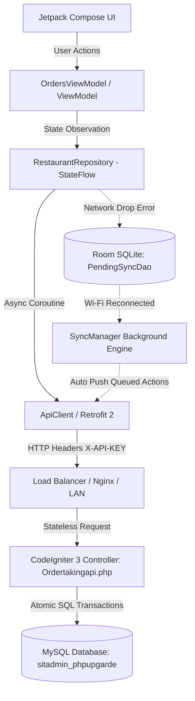
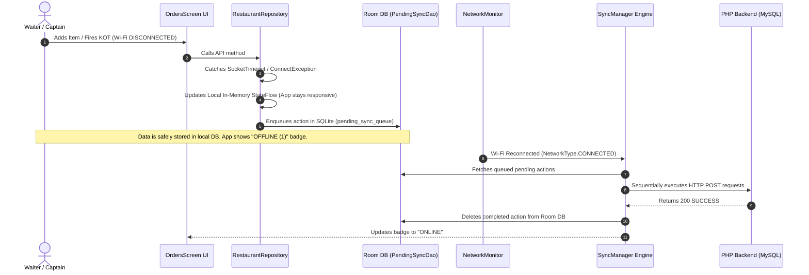

# 📘 Complete System Architecture, API & Request Handling Guide

**System Components:**
- 📱 **Android Client App (`res_order_taking`)**: Kotlin 2.0+, Jetpack Compose, MVVM Architecture, Retrofit 2 + OkHttp 4 + Moshi, Room SQLite Database, Coroutines & StateFlow.
- 🐘 **PHP Backend (`ElintOm_PHP_8.5`)**: CodeIgniter 3 MVC Framework, RESTful JSON Endpoints, MySQL Database with Atomic Transactions.

---

## 📑 Table of Contents
1. [📌 Architecture Overview](#1-architecture-overview)
2. [🔌 Step 1: API Design & Handling](#2-step-1-api-design--handling)
3. [⚡ Step 2: Android Request Handling Flow](#3-step-2-android-request-handling-flow)
4. [🌐 Step 3: Offline Resilience & Room Auto-Sync](#4-step-3-offline-resilience--room-auto-sync)
5. [⚖️ Step 4: Load Balancing & High-Traffic Scaling](#5-step-4-load-balancing--high-traffic-scaling)
6. [🛎️ Step 5: Complete Restaurant Dining Lifecycle](#6-step-5-complete-restaurant-dining-lifecycle)

---

## 1. 📌 Architecture Overview



---

## 2. 🔌 Step 1: API Design & Handling

The backend controller [`Ordertakingapi.php`](file:///c:/wamp64/www/ElintOm_PHP_8.5/app/controllers/Ordertakingapi.php) exposes 25+ RESTful JSON endpoints to power the dining flow.

### **Core API Design Rules:**
1. **Stateless Request Processing:** Each API endpoint operates independently using request headers (`X-API-KEY`) without forcing server sticky sessions.
2. **ID Sanitization & Parsing:** Incoming IDs with string prefixes (`ORD-101`, `T-05`, `P-12`) are automatically sanitized to pure integer IDs (`101`, `5`, `12`) to eliminate SQL type mismatch errors.
3. **Open Order Validation Guard:** Endpoints like `add_item()` check order status (`get_order_minimal`). If a passed `order_id` is already `Completed`, `Finalized`, or `Paid`, the API rejects the closed order and automatically opens a **fresh active order** for that table.
4. **Standard Uniform Response Structure:**
   ```json
   {
     "response": {
       "status": "SUCCESS",
       "message": "Operation completed successfully"
     },
     "data": { ... }
   }
   ```

---

## 3. ⚡ Step 2: Android Request Handling Flow

### **1. Asynchronous Execution Thread Pool (`Dispatchers.IO`)**
- Every network operation inside [`RestaurantRepository.kt`](file:///c:/wamp64/www/res_order_taking/app/src/main/java/com/example/data/repository/RestaurantRepository.kt) is invoked via Kotlin Coroutines:
  ```kotlin
  suspend fun addItemToOrder(...): Result<OrderBootstrap> = withContext(Dispatchers.IO) { ... }
  ```
- Keeps the Jetpack Compose main UI thread completely unblocked at 60 FPS.

### **2. Header Interception (`ApiClient.kt`)**
- [`ApiClient.kt`](file:///c:/wamp64/www/res_order_taking/app/src/main/java/com/example/data/api/ApiClient.kt) contains a custom `authInterceptor`:
  - Automatically injects `X-API-KEY`
  - Injects `Accept: application/json`
  - Applies OkHttp 15-second timeouts to prevent hung requests.

### **3. Reactive Single Source of Truth (`StateFlow`)**
- Moshi converts JSON responses into Kotlin data models.
- Updates central `MutableStateFlow` streams (`_tables`, `_orders`, `_menuItems`).
- UI automatically re-renders table status badges, guest accordions, and invoice previews.

---

## 4. 🌐 Step 3: Offline Resilience & Room Auto-Sync



### **Key Resilience Components:**
- **[`PendingSyncEntity.kt`](file:///c:/wamp64/www/res_order_taking/app/src/main/java/com/example/data/local/PendingSyncEntity.kt):** Room SQLite entity storing queued offline actions.
- **[`NetworkMonitor.kt`](file:///c:/wamp64/www/res_order_taking/app/src/main/java/com/example/data/sync/NetworkMonitor.kt):** Real-time `ConnectivityManager.NetworkCallback` observer.
- **[`SyncManager.kt`](file:///c:/wamp64/www/res_order_taking/app/src/main/java/com/example/data/sync/SyncManager.kt):** Background auto-sync worker triggered upon network restoration.

---

## 5. ⚖️ Step 4: Load Balancing & High-Traffic Scaling

1. **Stateless PHP Worker Scaling:** Because CodeIgniter APIs do not maintain server-side sticky session locks, traffic can be distributed across multiple PHP application servers behind a Load Balancer (Nginx / HAProxy / AWS ALB).
2. **Dynamic Server Base URL Routing:** Waiters can dynamically switch the server IP/Port (e.g. from local server `192.168.1.100` to primary load balancer `192.168.1.254`) via the in-app Settings Dialog (`ApiSettingsManager`) without reinstalling the application.
3. **OkHttp Socket Reuse & Connection Pooling:** Prevents port exhaustion on local restaurant servers during peak dining hours.

---

## 6. 🛎️ Step 5: Complete Restaurant Dining Lifecycle

| Phase | Action | System Behavior / Validation Rule |
| :--- | :--- | :--- |
| **1. Table Selection** | Captain selects Table | If `Available` -> opens clean session (`Guest 1`, `Guest 2`). If `Occupied` -> loads existing live order. |
| **2. Item Addition** | Add dish for Guest 1 or Table Common | Adds item to order. Table status transitions `Available` -> `Occupied`. Validation prevents adding items to closed/finalized orders. |
| **3. Fire KOT** | Click `KOT` button | Validates pending items exist. Updates item status to `KOT Sent` / `Preparing` and notifies Kitchen Display System (KDS). Table status transitions -> `Order Placed`. |
| **4. Kitchen Preparation** | Kitchen marks items ready | KDS updates item status to `Ready`. Table status transitions -> `Ready`. |
| **5. Mark Served** | Captain serves food | Click `Mark Served` -> item and table status transition -> `Served`. |
| **6. Finalize Order** | Click `Finalize Order` | **Validation Guard:** Blocked if order is empty or has unsent pending KOT items. On success -> generates official POS Sale record in `sma_sales`, marks order `Completed` / `Paid`, and releases table back to `Available`. |
